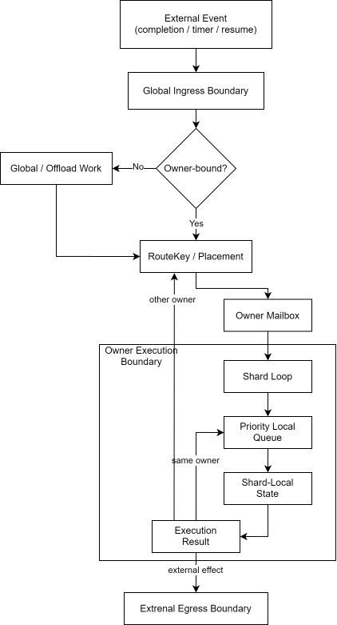
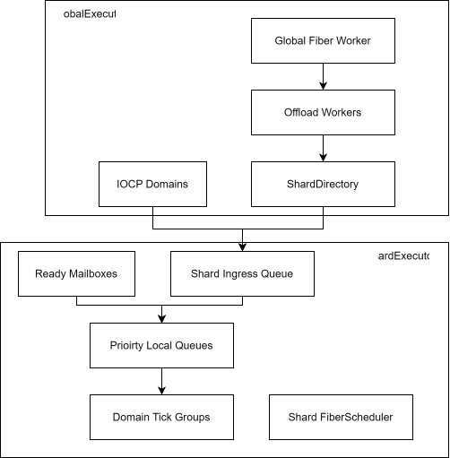
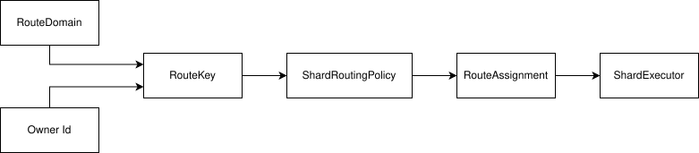
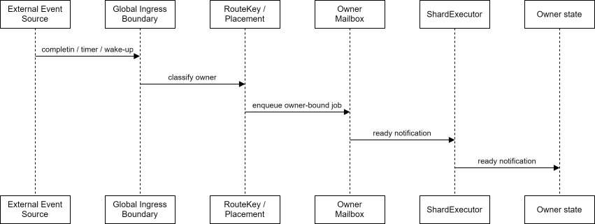
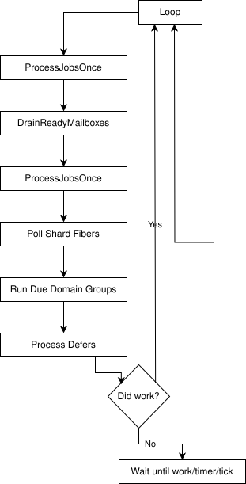
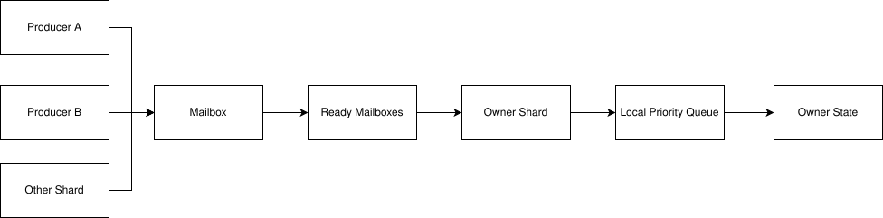
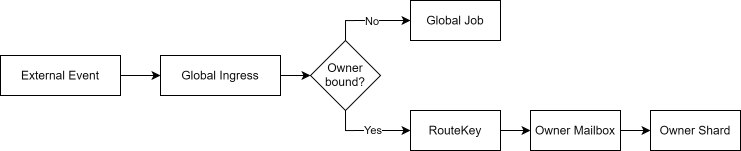
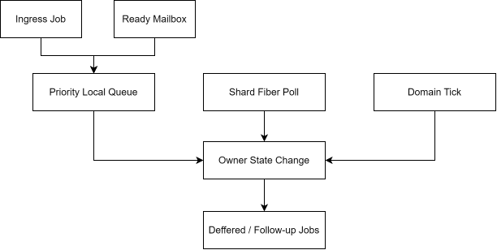
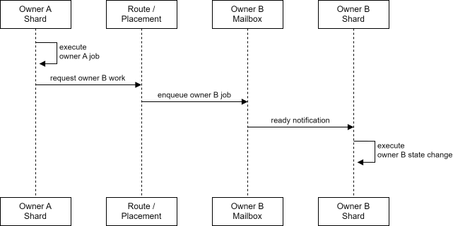
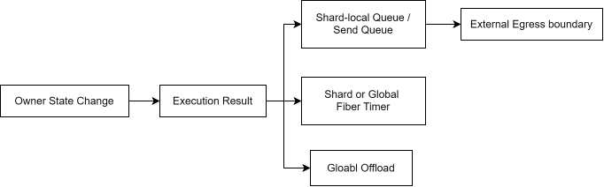

JamNet의 실행 모델은 **전역 병렬 처리와 owner 단위 직렬 처리를 분리하는 하이브리드 구조**입니다.

핵심은 스레드를 많이 쓰는 것이 아니라, **어떤 상태를 누가 소유하고, 그 상태 변경이 어느 실행 경계에서 직렬화되는지 명확히 만드는 것**입니다. JamNet은 owner가 없는 작업은 전역 계층에서 병렬 처리하고, 세션/월드/UserContext처럼 mutable state를 가진 작업은 route key를 통해 owner shard로 이동시켜 순차 실행합니다.

---

## 1. 먼저 보는 실행 흐름

JamNet의 실행 모델은 아래 흐름 하나로 요약할 수 있습니다. 특정 입력 종류가 아니라, **외부 이벤트가 JamNet 실행 모델 안에서 owner-bound state change로 바뀌는 흐름**입니다.

읽는 관점에서 중요한 점은 다음입니다.

- `GlobalExecutor`는 외부 이벤트를 흡수하고 owner가 정해지지 않은 작업을 처리합니다.
- `RouteKey`는 작업이 어느 shard에서 실행되어야 하는지 결정합니다.
- `Mailbox`는 여러 producer가 같은 owner에게 보내는 작업을 하나의 shard 소비 흐름으로 모읍니다.
- `ShardExecutor`는 owner-bound 작업을 순차 실행하는 실제 상태 변경 경계입니다.
- `FiberScheduler`는 기다리는 작업이 OS thread를 점유하지 않도록 대기 상태를 분리합니다.

이 흐름의 핵심은 **외부 이벤트 흡수와 owner state 변경이 같은 경계에서 섞이지 않는다**는 점입니다. Ingress는 이벤트를 실행 모델 안으로 들여오고, route/mailbox는 owner를 찾고, shard loop가 실제 상태 변경 순서를 보장합니다. 후속 작업도 직접 호출로 퍼지지 않고 같은 owner, 다른 owner, 외부 효과 중 하나로 다시 분류됩니다.

---

## 2. 설계 의도

JamNet은 다음 문제를 해결하기 위해 이 실행 모델을 선택했습니다.

반복해서 등장하는 핵심 철학은 하나입니다. **병렬성은 event 흡수와 독립 작업에 사용하고, mutable game state는 owner shard에서 순서를 갖고 바꾼다**는 것입니다. 이후 장에서 나오는 `GlobalExecutor`, `ShardExecutor`, `Mailbox`, `FiberScheduler`는 모두 이 원칙을 지키기 위한 실행 장치입니다.

| 문제 | 설계 선택 | 의도 |
| --- | --- | --- |
| 모든 작업을 전역 worker pool에서 실행하면 같은 세션/월드의 상태 변경 순서가 흔들림 | owner-bound 작업을 shard로 라우팅 | 상태 일관성을 lock 획득 순서가 아니라 실행 위치로 설명하기 위해 |
| 외부 이벤트 처리자가 owner 상태 변경까지 수행하면 실행 경계가 흐려짐 | external ingress와 owner shard 경계 분리 | event 흡수는 짧게 유지하고, 상태 변경은 shard로 넘기기 위해 |
| 여러 producer가 같은 owner에게 동시에 작업을 보낼 수 있음 | owner mailbox 사용 | MPSC 입력을 단일 shard 소비 흐름으로 모으기 위해 |
| timeout/RPC wait/timer가 OS thread를 점유하면 worker 활용률이 낮아짐 | fiber scheduler 사용 | 대기 상태를 thread block이 아니라 재개 가능한 작업으로 표현하기 위해 |
| 특정 shard나 mailbox가 병목이 될 수 있음 | queue depth, busy ratio, tick catch-up 등 관측 지점 제공 | 병목 위치를 전역/샤드/owner 단위로 구분하기 위해 |
| 월드, 세션, 사용자 컨텍스트의 배치 기준이 서로 다름 | route domain과 placement 정책 분리 | 단순 hash가 아니라 domain 특성에 맞는 배치를 하기 위해 |

---

## 3. 세부 구조 요약

세부 구조는 네 계층으로 나눠 볼 수 있습니다.

| 구성 요소            | 책임                                                                        | 상태 변경 성격             |
| ---------------- | ------------------------------------------------------------------------- | -------------------- |
| `GlobalExecutor` | external ingress worker, offload worker, global fiber, shard directory 관리 | owner 상태 직접 변경 없음    |
| `ShardExecutor`  | owner-bound job, mailbox 소비, shard-local fiber, domain tick 실행            | owner 상태 변경          |
| `Mailbox`        | cross-thread/cross-shard owner message 전달                                 | 직접 실행하지 않고 shard로 전달 |
| `FiberScheduler` | sleep, timeout, periodic, resume/cancel 처리                                | 실행 위치에 따라 다름         |

이 구조에서 `GlobalExecutor`는 병렬성과 외부 이벤트 흡수를 담당하고, `ShardExecutor`는 상태 변경의 순서를 담당합니다. `Mailbox`는 두 세계를 연결하는 owner-bound ingress입니다.

---

## 4. 설계 배경

JamNet은 MMO-like 서버를 목표로 하기 때문에 소켓 완료 이벤트, 세션 상태 갱신, 월드 tick, 물리 연동, replication, RPC 응답 대기, 예약 작업이 같은 런타임 안에 들어옵니다.

이 환경에서 중요한 선택지는 2장에서 설명한 원칙으로 정리됩니다. 싱글 스레드는 순서를 이해하기 쉽지만 전체 응답성을 막고, 전역 worker pool은 처리량은 얻지만 owner별 상태 순서가 흔들립니다. JamNet은 그 중간 지점으로 **owner가 없는 작업은 전역에서 흡수하고, owner가 생긴 순간 shard로 이동**시키는 구조를 선택했습니다.

---

## 5. 핵심 설계 목표

이 장은 설계 선택의 배경만 짧게 정리합니다. 구체적인 owner 배치와 routing 규칙은 6장에서 다룹니다.

### 5.1 상태 순서가 성능보다 먼저 깨질 수 있음

MMO-like 서버에서는 세션 처리, 월드 tick, 물리 연동, replication이 같은 상태를 연속해서 바꿉니다. 이 작업을 전역 worker pool에 그대로 흩뿌리면 처리량은 얻을 수 있지만, 같은 owner의 상태가 어떤 순서로 바뀌었는지 추적하기 어려워집니다.

### 5.2 외부 이벤트와 상태 변경의 비용이 다름

외부 이벤트 흡수는 짧고 빈번해야 하고, owner 상태 변경은 순서와 문맥이 필요합니다. 두 작업을 같은 실행 위치에 섞으면 event ingress가 긴 게임 로직에 막히거나, 반대로 상태 변경이 여러 thread에 흩어져 디버깅이 어려워집니다.

### 5.3 대기 흐름이 worker를 점유하면 안 됨

timer, timeout, RPC wait, delayed continuation은 지금 CPU를 써야 하는 작업이 아닙니다. 이를 blocking wait로 처리하면 runnable job이 있어도 worker가 묶입니다. JamNet은 이런 대기를 fiber로 분리할 필요가 있었습니다.

### 5.4 운영 중 병목 위치를 구분해야 함

queue는 부하를 없애지 않고 지연시킵니다. 따라서 병목이 external ingress, offload, shard, mailbox, fiber, tick 중 어디에서 생기는지 구분할 수 있어야 운영 파라미터를 조정할 수 있습니다.

---

## 6. Ownership과 Routing

JamNet의 실행 모델에서 가장 중요한 규칙은 **상태 소유권과 routing이 함께 움직인다**는 점입니다. Owner는 상태를 가진 객체이고, route는 그 owner의 상태 변경을 실행할 shard를 결정합니다.

Owner는 다음과 같은 단위입니다.

- Session: 연결 상태, sequence/reliability/order state, RPC state, send queue
- World: membership, world runtime state, ECS registry, tick 대상 시스템
- UserContext: account/user 단위의 session binding, joined world membership, in-flight world action state

Actor는 현재 코드에서 별도 owner/domain으로 배치되지 않습니다. Actor의 replication 대상 상태, physics/character state, ownership/control meta는 world의 ECS/replication 흐름 안에서 처리되고, 사용자의 접속/월드 소속/전이 상태는 `UserContext`가 shard-local user state로 들고 갑니다.

각 owner는 route key를 통해 shard에 배치됩니다. route key는 domain과 id를 기반으로 만들어지며, domain은 "이 id를 어떤 기준으로 분산하거나 붙여둘 것인가"를 설명합니다.

Routing이 해야 하는 일은 단순 hash보다 넓습니다.

| Routing 관심사 | 의미 |
| --- | --- |
| Stable spread | 같은 id가 매번 다른 shard로 흔들리지 않게 배치 |
| Placement override | 특정 owner를 특정 shard/domain에 명시적으로 배치 |
| Affinity hint | session-user, user-world처럼 함께 움직이는 owner의 왕복 비용 감소 |
| Load-aware placement | hot shard를 피하거나 새 owner를 여유 shard에 배치 |
| Route release | session 종료, world shutdown 후 stale route 제거 |

기본 규칙은 다음과 같습니다.

- 같은 owner의 mutable state는 같은 shard에서 변경합니다.
- owner가 바뀌면 route lookup을 다시 수행합니다.
- cross-owner 작업은 직접 호출이 아니라 다음 owner의 mailbox/job으로 변환합니다.
- routing 정책은 domain 특성에 따라 달라질 수 있습니다.

도메인별 운영 의미도 다릅니다.

| Domain | 배치에서 중요한 점 |
| --- | --- |
| Session | 접속 수와 packet 처리량이 특정 shard에 몰리지 않게 균등 분산 |
| World | tick, membership, ECS state가 같은 실행 경계에 남도록 co-location 우선 |
| UserContext / ClientPrincipal | account/user 기준 session binding과 world action state가 같은 실행 경계에서 갱신되도록 유지 |
| Background/Global | owner state와 무관한 작업은 shard를 점유하지 않게 분리 |

이 구조의 trade-off는 routing table과 placement 정책이 운영 대상이 된다는 점입니다. 대신 hot owner, world co-location, session/user 분산을 같은 추상화 위에서 조정할 수 있습니다.

---

## 7. GlobalExecutor

`GlobalExecutor`는 owner가 없거나 owner로 라우팅되기 전의 작업을 처리합니다. 현재 구조에서는 shard directory 초기화, external ingress domain 관리, offload worker, global fiber worker, route placement API를 함께 담당합니다.

### 7.1 주요 책임

`GlobalExecutor`의 책임은 다음과 같습니다.

- shard directory 생성과 shard executor start/stop/join
- external ingress domain 생성과 worker thread 실행
- owner가 없는 offload job 실행
- global timer, `SubmitAfter`, periodic job 관리
- global fiber spawn/resume/cancel
- route key 생성, route placement, route release
- 모든 shard로 broadcast성 job 전달
- executor metrics snapshot 수집

`GlobalExecutor`의 관심사는 owner 이전 단계입니다. 외부 입력, 전역 대기, offload, route directory처럼 shard에 도달하기 전의 작업을 정리합니다.

### 7.2 External Event Ingress

외부 이벤트는 owner shard 바깥에서 먼저 흡수됩니다. JamNet은 OS completion, timer, external wake-up 같은 외부 신호를 먼저 전역 ingress 경계에서 받아들이고, owner가 필요한 순간 route key와 mailbox로 변환합니다.

OS completion 같은 외부 신호는 이 흐름의 한 예시입니다. 중요한 것은 completion 종류가 아니라, 외부 신호가 owner-bound job으로 바뀌는 지점입니다.

전역 ingress는 이벤트를 실행 모델 안으로 들여오는 역할이고, state 변경은 route 이후의 shard 단계에서 다룹니다.

### 7.3 Offload Worker

`Submit()`으로 들어온 전역 job은 offload queue에 들어갑니다. offload worker는 queue에서 job을 꺼내 실행합니다. 이 경로는 owner 상태를 직접 수정하지 않는 계산, 전역 작업, 또는 shard로 전달하기 전 준비 작업에 적합합니다.

Offload worker는 owner 순서 보장을 제공하지 않으므로, CPU-bound 준비 작업이나 owner와 무관한 전역 작업에 적합합니다.

### 7.4 Global Fiber Worker

`GlobalExecutor`의 fiber worker는 전역 timer와 대기 흐름을 담당합니다. `SubmitAfter`, `ScheduleFixedRate`, `ScheduleFixedDelay`는 worker thread를 sleep시키지 않고 fiber scheduler에 등록됩니다. 시간이 되면 fiber가 깨어나 실제 job을 다시 offload queue에 제출합니다.

Fixed-rate는 기준 주기를 유지하려고 하며, 밀린 실행은 `maxCatchUp` 한도 안에서 따라잡습니다. Fixed-delay는 한 번 실행한 뒤 다음 delay를 다시 잡는 방식입니다. 이 둘은 운영 의미가 다르므로, tick성 작업과 유지보수성 작업을 구분해서 선택해야 합니다.

---

## 8. ShardExecutor

`ShardExecutor`는 owner-bound 상태 변경의 핵심 실행 경계입니다. 각 shard는 자체 thread, ingress queue, ready mailbox queue, priority local queue, fiber scheduler, domain tick group을 가집니다.

### 8.1 ShardLocal

Shard 내부에는 `ShardLocal`이 있습니다. 여기에는 shard-local ECS registry, shard index, scheduler, session/world/user state, deferred 작업, domain system group이 모입니다.

이 구조의 의미는 shard 내부 시스템이 전역 상태를 매번 찾아다니지 않고, 해당 shard의 local context를 기준으로 실행된다는 점입니다. 세션 시스템, 월드 시스템, replication 시스템이 shard tick 안에서 같은 local context를 공유할 수 있습니다.

### 8.2 Shard Loop

Shard loop는 단일 흐름에서 여러 입력원을 공정하게 섞어 처리합니다.

현재 구현 기준으로 loop는 먼저 ingress/local job을 한 번 처리하고, ready mailbox를 제한된 예산 안에서 local queue로 옮긴 뒤, 다시 local job을 처리합니다. 이후 shard-local fiber를 poll하고, tick 시간이 된 domain group을 실행합니다. 마지막으로 defer를 처리하고, 할 일이 없으면 다음 wake-up, fiber deadline, domain tick 시각 중 가장 가까운 시점까지 대기합니다.

이 순서의 목적은 mailbox만 소비하거나 tick만 실행하는 단일 목적 루프가 아니라, 이벤트 기반 job과 tick 기반 시스템을 같은 실행 경계 안에서 조율하는 것입니다.

운영적으로 이 순서에는 다음 의미가 있습니다.

| 순서 | 이유 |
| --- | --- |
| ingress/local job을 먼저 처리 | 이미 shard에 들어온 critical/control job을 tick보다 먼저 반영해 stale 상태로 tick이 시작되는 상황을 줄임 |
| ready mailbox를 local queue로 이동 | 여러 producer가 밀어 넣은 owner message를 shard-local priority 체계 안으로 편입 |
| mailbox 이후 local execute를 한 번 더 수행 | 방금 옮긴 mailbox job을 다음 loop까지 미루지 않고 같은 iteration에서 일부 처리해 mailbox latency를 줄임 |
| fiber poll을 tick 직전에 수행 | timeout/resume된 continuation이 tick 전에 상태를 갱신할 기회를 주되, budget으로 fiber가 shard를 독점하지 못하게 함 |
| domain tick 실행 | job과 continuation으로 정리된 최신 owner state를 기준으로 simulation/replication tick 수행 |
| defer 처리 후 대기 | loop 중 생성된 정리 작업을 마지막에 모아 처리하고, 다음 wake-up/deadline/tick 중 가장 가까운 시점까지 sleep |

즉 loop 순서는 처리량만을 위한 순서가 아니라, **event latency, tick freshness, continuation fairness** 사이의 균형입니다.

### 8.3 Local Queue와 Job Priority

Shard는 외부 ingress job과 mailbox에서 옮겨온 job을 priority local queue에 넣습니다. priority는 크게 critical, control, background 계열로 나뉩니다.

Critical job은 handshake, close, shutdown처럼 지연되면 위험한 작업에 적합합니다. Control job은 RPC나 제어 메시지처럼 일반 작업보다 우선순위가 높은 작업에 적합합니다. Background 계열은 일반 패킷 처리, 정리, 통계성 작업처럼 밀려도 시스템 의미가 크게 깨지지 않는 작업에 적합합니다.

Shard는 control 계열을 우선하되, 일정 횟수 이상 연속으로 control만 소비하면 background도 실행할 수 있게 합니다. 이는 제어 메시지 우선권을 주면서도 일반 작업이 완전히 굶지 않게 하기 위한 정책입니다.

### 8.4 Batch Budget

Shard loop의 중요한 운영 파라미터는 `batchBudget`입니다. ingress drain, local job execution, fiber poll은 모두 예산을 가지고 실행됩니다.

예산이 너무 크면 한 loop에서 처리량은 좋아질 수 있지만, 특정 종류의 작업이 shard를 오래 점유해 tail latency가 나빠질 수 있습니다. 반대로 예산이 너무 작으면 응답성은 좋아질 수 있지만 burst 이후 backlog 회복력이 떨어집니다.

따라서 `batchBudget`은 절대적인 정답이 있는 값이 아니라, 부하 패턴과 tick 주기에 맞춰 조정해야 하는 운영 파라미터입니다.

### 8.5 Domain Tick

Shard는 `ShardSystemGroup` 단위로 tick 시스템을 등록합니다. 각 group은 domain tag, tick period, next tick time, bootstrap 함수, system 함수 목록을 가집니다.

Tick은 shard thread 안에서 실행됩니다. 이 덕분에 tick 중 변경되는 ECS/world/session 상태와 이벤트 job이 변경하는 상태가 같은 실행 경계 안에서 순서를 갖습니다.

지연이 발생하면 shard는 `maxTickCatchUp` 한도 안에서 누락 tick을 따라잡습니다. 한도를 넘으면 다음 tick 기준을 현재 시각 이후로 밀어 무한 catch-up에 빠지지 않게 합니다.

이 정책의 trade-off는 명확합니다.

- catch-up을 많이 허용하면 simulation tick 정확도는 좋아질 수 있지만, shard가 오래 점유된다.
- catch-up을 적게 허용하면 응답성은 좋아지지만, 지연된 tick을 생략하거나 압축하는 효과가 생긴다.

---

## 9. Mailbox

`Mailbox`는 owner-bound 작업을 shard로 전달하는 MPSC queue입니다. producer는 external ingress worker, offload worker, 다른 shard, 같은 shard 모두가 될 수 있지만 consumer는 owner가 귀속된 shard 하나입니다.

### 9.1 Ready Notification

Mailbox의 핵심은 queue에 job이 들어올 때마다 shard를 깨우지 않는 것입니다. 비어 있던 mailbox에 첫 job이 들어올 때만 ready notification을 올리고, 이미 처리 대기 중이면 중복 wake-up을 줄입니다.

Shard는 ready mailbox id를 가져와 mailbox 안의 job을 제한된 수만큼 local queue로 옮깁니다. 이때 mailbox job은 바로 실행되지 않고 local queue로 wrapping되어 들어갑니다. 실행이 끝나면 mailbox의 in-flight 상태가 감소하고, 아직 남은 작업이 있으면 다시 ready queue에 올라갑니다.

이 구조의 장점은 다음과 같습니다.

- 여러 producer가 같은 owner로 작업을 보낼 수 있다.
- owner 상태 변경은 shard thread 하나에서 순차 처리된다.
- wake-up 폭증을 줄일 수 있다.
- 특정 mailbox가 shard를 독점하지 않도록 budget을 적용할 수 있다.

### 9.2 Close 정책

Mailbox는 close mode를 가집니다. Drain은 이미 들어온 작업을 처리하고 닫는 정책이고, Abort는 pending 작업을 버리는 정책입니다.

이 차이는 session disconnect, world shutdown, server shutdown에서 중요합니다. owner lifecycle이 끝날 때 남은 작업을 모두 처리해야 하는지, 더 이상 의미 없는 작업을 버려야 하는지는 shutdown 정책에 따라 달라집니다.

---

## 10. FiberScheduler

JamNet의 fiber는 병렬 실행을 늘리기 위한 도구가 아니라 **대기 상태를 OS thread 점유 없이 표현하기 위한 도구**입니다.

사용 예시는 다음과 같습니다.

- `SubmitAfter`
- `ScheduleFixedRate`
- `ScheduleFixedDelay`
- timeout 기반 후속 처리
- RPC 응답 대기
- 외부 이벤트 resume/cancel

Global fiber와 shard-local fiber는 역할이 다릅니다.

| 위치 | 용도 |
| --- | --- |
| Global fiber | owner가 없는 timer, 전역 periodic, offload 재개 |
| Shard fiber | owner-bound 대기, shard-local timer, 상태 변경과 연결된 continuation |

대기 후 상태 변경이 필요하다면 shard-local fiber 또는 shard job으로 돌아와야 합니다. global fiber에서 owner 상태를 직접 변경하면 실행 모델의 ownership 규칙을 깨게 됩니다.

구현 관점에서 `FiberScheduler`는 다음 상태를 나눠 관리합니다.

| 내부 상태 | 역할 |
| --- | --- |
| ready priority queue | 실행 가능한 fiber를 priority와 enqueue sequence 기준으로 선택 |
| sleep priority queue | wakeup 시각이 있는 fiber를 deadline 순서로 보관 |
| wait map | `FiberAwaitKey`로 suspend된 fiber를 외부 resume/cancel과 연결 |
| inbox queues | 다른 thread에서 들어온 spawn/resume/cancel 요청을 scheduler owner thread로 전달 |
| fiber metadata | 상태, resume code, cancel token, deadline, stack 사용량, 실행 시간 누적 |

`Poll()`은 inbox를 먼저 비우고, 만료된 sleep 항목을 ready 상태로 옮긴 뒤, budget 안에서 ready fiber를 실행합니다. fiber가 `SleepUntil()`을 호출하면 sleep queue로 이동하고, `Suspend()`를 호출하면 wait map에 등록됩니다. 외부 이벤트가 `PostResume()`이나 `PostCancel*()`을 호출하면 직접 fiber를 깨우지 않고 inbox에 메시지를 넣고, scheduler owner thread가 다음 poll에서 상태 전이를 처리합니다.

이 구조 덕분에 timer, RPC wait, timeout은 OS thread를 block하지 않으면서도 shard-local continuation으로 돌아올 수 있습니다. 동시에 budget을 통해 한 tick에서 fiber 재개가 shard loop를 독점하지 않도록 제어할 수 있습니다.

---

## 11. End-to-End Execution Flow

11장은 앞 장들의 규칙을 다시 설명하지 않고, 하나의 event가 실행 단계로 어떻게 쪼개지는지만 보여줍니다.

### 11.1 Event Ingress to Owner Job

외부 이벤트는 먼저 전역 ingress 경계에 들어옵니다. 이 단계에서는 event를 짧게 해석하고, owner가 필요한 작업이면 route key를 만들어 mailbox 또는 shard ingress로 넘깁니다.

이 단계의 결과물은 "실행할 함수"가 아니라 "어느 owner에서 실행할 job인가"입니다.

### 11.2 Shard Execution Step

Shard에 도착한 job은 shard loop의 일부로 처리됩니다. ingress job, ready mailbox, local priority queue, shard-local fiber, domain tick은 같은 thread에서 섞이지만, 각각 batch budget과 priority의 영향을 받습니다.

이 단계에서는 owner state 변경, delayed continuation, tick 실행이 실제로 interleave됩니다. 자세한 loop 순서는 8.2에서 다룹니다.

### 11.3 Cross-owner Continuation

하나의 owner job이 다른 owner 작업을 만들 수 있습니다. 이때 현재 job은 결과를 확정하고, 다음 owner에 대한 별도 job을 enqueue합니다.

즉 end-to-end 흐름은 단일 call stack이 아니라, owner 경계를 지날 때마다 job으로 끊어지는 실행 그래프에 가깝습니다.

### 11.4 Result and External Egress

Owner state 변경 결과는 외부 효과로 이어질 수 있습니다. 이때 shard는 결과의 의도를 확정하고, 실제 외부 등록이나 지연 실행은 send queue, offload job, timer, deferred job 같은 다음 단계로 넘깁니다.

이 장의 목적은 "어떤 API를 호출했는가"가 아니라, event가 ingress, owner job, continuation, egress 단계로 나뉘어 실행된다는 점을 보여주는 것입니다.

---

## 12. Backpressure와 Overload

Shard/mailbox 구조는 burst를 queue로 흡수합니다. 하지만 queue는 부하를 없애는 장치가 아니라 지연시키는 장치입니다. 따라서 과부하 상황에서는 입력을 제한하거나 중요도를 조정해야 합니다.

JamNet 실행 모델에서 관측해야 할 지점은 다음과 같습니다.

- Global offload queue size
- shard ingress queue size
- shard local queue size
- ready mailbox 처리량
- mailbox job move count
- shard idle/did-work loop 비율
- scheduler ready run count
- tick catch-up count
- external ingress worker와 offload worker busy 비율

과부하 대응 방향은 다음과 같습니다.

- 특정 shard backlog가 커지면 해당 domain routing을 재검토한다.
- 특정 mailbox가 계속 재등록되면 hot owner로 보고 입력 rate를 제한한다.
- non-critical job은 지연하거나 drop 가능한 형태로 분리한다.
- replication snapshot은 중요도와 전송 예산에 따라 낮은 우선순위를 줄인다.
- tick catch-up이 잦으면 tick period, batch budget, shard 배치 정책을 함께 조정한다.

---

## 13. Thread Affinity와 NUMA

JamNet은 executor 배치를 자동 계산하고, thread affinity를 적용할 수 있는 구조를 가지고 있습니다. `CoreLayout`은 shard, offload, fiber, external ingress worker 수를 계산하고, affinity 설정이 켜져 있으면 물리 코어 슬롯을 round-robin으로 배정합니다.

운영 관점에서 가장 중요한 원칙은 shard thread를 안정적인 물리 코어에 우선 배치하는 것입니다. Shard는 owner-bound 상태 변경과 tick을 처리하는 단일 소비자 루프이므로, SMT sibling과 과도하게 경쟁하면 tick jitter와 tail latency가 커질 수 있습니다.

권장 배치 순서는 다음과 같습니다.

1. main thread와 OS/background 용도로 일부 core를 남긴다.
2. shard thread를 NUMA node별로 고르게 배치한다.
3. offload worker를 남는 물리 core에 배치한다.
4. fiber worker와 보조 worker는 상대적으로 덜 민감한 slot에 배치한다.
5. NUMA 환경에서는 shard가 자주 만지는 hot data와 buffer도 가능한 한 같은 node에 위치시키는 방향을 고려한다.

현재 구조는 thread pinning hook와 affinity plan을 제공하므로, 추후 부하 측정 결과에 따라 배치 정책을 더 정교하게 조정할 수 있습니다.

---

## 14. 메트릭과 검증 관점

실행 모델의 품질은 평균 처리량 하나로 판단하기 어렵습니다. JamNet에서 중요한 지표는 처리량, queue wait, tail latency, shard imbalance, wait isolation을 함께 보는 것입니다.

| 지표 | 의미 |
| --- | --- |
| 처리량 | 초당 완료 job 수, shard/offload별 실행량 |
| p95/p99 latency | burst 또는 hot owner 상황에서 tail이 얼마나 튀는지 |
| queue wait | enqueue 이후 실제 실행 시작까지 걸린 시간 |
| shard max queue | 단일 shard 병목 여부 |
| shard stddev | shard 간 처리량 불균형 |
| worker busy/idle | 병목이 CPU 포화인지 queue/routing 문제인지 구분 |
| mailbox jobs/s | mailbox 기반 owner 직렬화 경로 사용량 |
| tick catch-up/s | tick이 밀리고 있는지 확인 |
| fiber ready runs/s | wait-heavy workload에서 fiber 재개량 |

검증 시나리오는 다음 질문에 답해야 합니다.

- owner hotspot에서 shard 직렬화가 lock 기반 모델보다 tail latency를 안정적으로 유지하는가?
- wait-heavy workload에서 fiber suspend가 thread block보다 runnable job의 tail latency를 덜 흔드는가?
- burst 이후 queue가 회복되는가, 아니면 특정 shard에 backlog가 남는가?
- saturation 구간에서 처리량 증가가 멈추는 지점과 tail latency가 급격히 증가하는 지점은 어디인가?
- routing policy가 shard imbalance를 줄이는가, 또는 cross-shard 왕복을 늘리는가?

### 14.1 101 client server executor metrics 분석

`reports/101-client_server_executor_metrics.csv`는 101 client session 테스트를 수행할 때 서버에서 수집한 executor snapshot입니다. 약 115초 동안 5초 간격으로 global executor와 shard 4개의 지표를 기록했으며, 총 120개 row입니다.

Global executor는 이 테스트에서 owner-bound workload를 직접 처리하지 않았습니다. `jobExecPerSec`는 0이고 `idleRatio`는 1.0으로 유지됩니다. 이는 네트워크/session/world 처리가 route 이후 shard 쪽에서 수행되었음을 보여줍니다.

Shard별 전체 구간 평균은 다음과 같습니다. 여기서 `tick/s`는 하나의 게임 월드 frame rate가 아니라 shard 안에서 실행된 domain tick 호출량과 catch-up 처리가 합쳐진 executor 관측값입니다.

| shard | job exec/s | ingress job/s | process jobs/s | mailbox process/s | mailbox move/s | scheduler ready run/s | tick/s | idle ratio |
| --- | ---: | ---: | ---: | ---: | ---: | ---: | ---: | ---: |
| 0 | 1,817.316 | 756.502 | 4,138.316 | 1,350.706 | 1,060.813 | 0.233 | 613.498 | 0.474 |
| 1 | 1,364.702 | 549.345 | 3,248.188 | 1,074.226 | 815.358 | 0.325 | 599.730 | 0.477 |
| 2 | 2,600.770 | 2,143.044 | 3,967.410 | 541.613 | 457.727 | 54.718 | 665.860 | 0.456 |
| 3 | 1,126.443 | 479.256 | 2,775.617 | 806.881 | 647.186 | 0.500 | 593.630 | 0.471 |

부하가 올라간 뒤의 안정 구간에서는 차이가 더 분명합니다.

| shard | job exec/s | ingress job/s | process jobs/s | mailbox process/s | scheduler ready run/s | tick/s |
| --- | ---: | ---: | ---: | ---: | ---: | ---: |
| 0 | 2,451.935 | 1,030.257 | 5,821.373 | 1,814.439 | 0.046 | 878.551 |
| 1 | 2,035.858 | 818.614 | 4,822.874 | 1,615.692 | 0.092 | 856.626 |
| 2 | 3,713.147 | 3,045.123 | 6,483.565 | 794.318 | 60.126 | 948.279 |
| 3 | 1,571.082 | 666.098 | 3,851.491 | 1,141.964 | 0.185 | 842.270 |

해석은 다음과 같습니다.

- shard 2의 `jobExecPerSec`와 `ingressJobPerSec`가 가장 높습니다. 이 테스트에서는 `ServerPhysicalWorld`가 하나만 생성되어 world owner와 world-domain tick/fiber 흐름이 한 shard에 집중되므로, 이 값을 일반적인 shard 분산 실패로 해석하면 안 됩니다.
- shard 2만 `schedulerReadyRunPerSec`가 약 60/s로 높게 나옵니다. 이는 하나의 physical world가 주기적 world 작업을 만들고, 해당 owner가 배치된 shard-local scheduler에서 계속 재개되는 형태로 보는 것이 자연스럽습니다.
- shard 0, 1, 3은 mailbox 기반 session 작업 비중이 더 큽니다. 안정 구간 기준 `mailboxProcessPerSec`는 shard 0이 1,814/s, shard 1이 1,616/s, shard 3이 1,142/s로 높고, shard 2는 794/s로 낮습니다.
- 전체 shard의 `idleRatio`는 대략 0.46~0.48 범위입니다. 이 테스트는 CPU 포화 한계 측정보다는 owner routing, mailbox drain, world tick이 실제 executor metric에 어떻게 나타나는지 확인하는 성격이 강합니다.
- `tickCatchUpPerSec`가 일부 구간에서 높게 보이지만, 안정 구간 평균은 shard 2가 12.337/s로 가장 낮습니다. 초반 부하 상승 구간과 domain tick catch-up이 섞여 있으므로, tick 지연 한계는 별도 고정 부하 테스트로 분리 측정해야 합니다.

따라서 이 결과는 두 가지를 확인합니다. 첫째, 101 client session의 네트워크 처리는 global executor가 아니라 shard owner 경계에서 처리됩니다. 둘째, 테스트 환경처럼 world가 하나뿐이면 특정 shard가 높게 나오는 것이 정상입니다.

이 결과를 기준으로 한 확장 기대치는 보수적으로 해석해야 합니다. 현재 측정에서는 **101개 client가 들어간 `ServerPhysicalWorld` 하나를 shard 하나가 담당해도 해당 shard가 CPU 포화 상태로 보이지 않았고**, 안정 구간에서 가장 높은 shard 2도 `idleRatio`가 약 0.47 수준으로 남아 있었습니다. 따라서 같은 성격의 physical world를 추가로 만들고 route placement가 서로 다른 shard에 배치된다면, world-domain tick/fiber처럼 world owner에 묶인 작업은 활성 world를 담당하는 shard 수에 따라 분산될 것으로 기대할 수 있습니다.

다만 이 기대치는 여러 world를 실제로 생성한 실측값은 아닙니다. session mailbox, network flush, OS send/recv, replication payload 생성처럼 shard 밖의 공유 비용이나 world 간 상호작용이 커지면 선형 확장은 깨질 수 있습니다. 

---

## 15. 한계와 Trade-off

### 15.1 Shard hotspot

Shard 모델은 같은 owner의 순서를 보장하지만, 특정 owner나 world에 부하가 몰리면 해당 shard가 병목이 됩니다. shard 수를 늘리는 것만으로 해결되지 않고, routing policy와 owner 분할 기준을 함께 조정해야 합니다.

### 15.2 Cross-owner latency

다른 owner로 메시지를 보내는 구조는 직접 호출보다 한 단계 늦습니다. 대신 상태 변경 경계가 명확해지고 lock 경합이 줄어듭니다. 즉 JamNet은 즉시성 일부를 포기하고 일관성과 운영 가능성을 얻는 선택을 했습니다.

### 15.3 Fiber 디버깅 복잡도

Fiber는 wait 비용을 줄여주지만, 일반 call stack만 보는 방식보다 디버깅이 어렵습니다. 따라서 fiber는 모든 작업에 남용하기보다 timer, timeout, RPC wait처럼 대기 의미가 분명한 흐름에 제한적으로 사용하는 편이 적절합니다.

### 15.4 완전한 장애 격리 부족

Shard는 상태 소유권과 실행 경계로는 유용하지만, actor model 수준의 완전한 fault isolation은 아닙니다. 하나의 job이 치명적 오류를 만들면 shard 상태 전체가 영향을 받을 수 있습니다. 향후에는 job 실패 정책, shard drain, mailbox close, world transfer rollback을 더 명확한 supervisor 정책으로 묶어야 합니다.

---

## 16. 요약

JamNet의 실행 모델은 **lock 중심 공유 상태 모델이 아니라 ownership + routing + mailbox 기반 실행 모델**입니다.

핵심은 다음과 같습니다.

- `GlobalExecutor`는 I/O, offload, 전역 fiber, shard directory를 관리한다.
- `ShardExecutor`는 owner-bound 상태 변경과 domain tick을 직렬 실행한다.
- `Mailbox`는 cross-thread/cross-owner message를 owner shard로 모은다.
- `FiberScheduler`는 대기 비용을 OS thread block에서 분리한다.
- routing policy는 상태 일관성과 shard 부하 분산을 동시에 결정한다.

이 구조는 단순한 멀티스레드 최적화가 아니라, MMO-like 서버에서 필요한 **처리량, 응답성, 상태 일관성의 균형을 맞추기 위한 실행 아키텍처**입니다.
