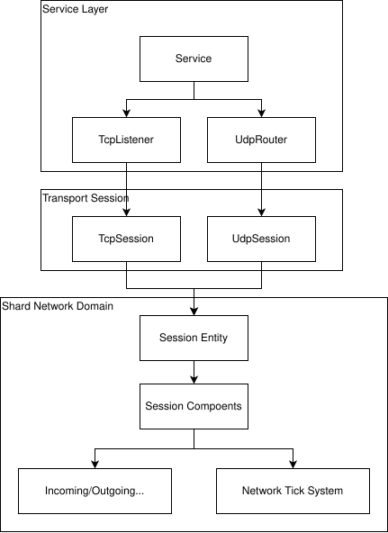
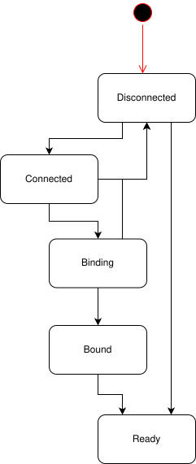
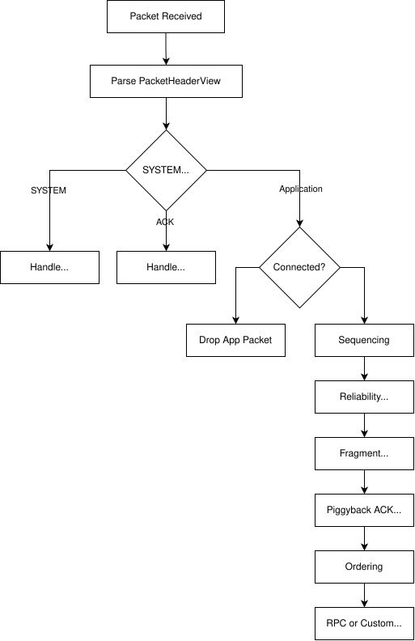
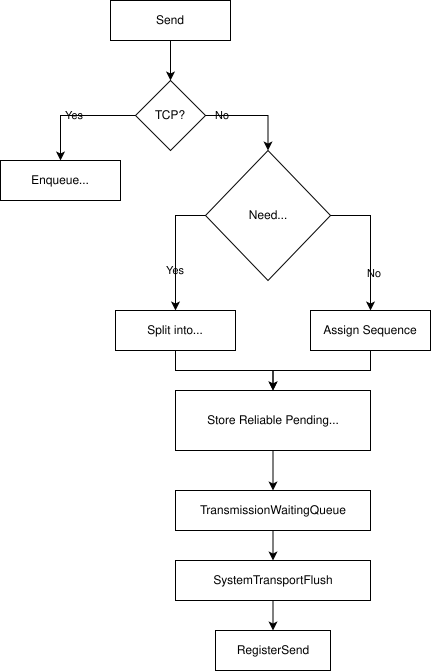
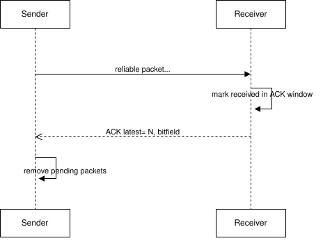
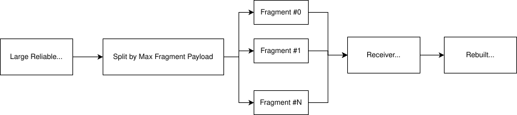
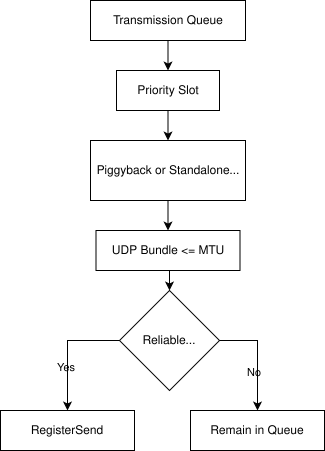

JamNet의 네트워크 모델은 **TCP와 UDP를 모두 지원하되, 실시간 게임 데이터는 데이터 의미에 따라 전송 정책을 선택하는 channel 기반 구조**입니다. TCP의 안정성과 UDP의 낮은 지연을 단순히 둘 중 하나로 선택하지 않고, 패킷 단위로 reliable, ordered, sequenced, unreliable 정책을 분리합니다.

핵심 목표는 다음과 같습니다.

- 연결/세션/바인딩 상태는 명확한 lifecycle로 관리한다.
- IOCP worker는 네트워크 완료를 빠르게 흡수하고, 세션 상태 변경은 shard에서 처리한다.
- snapshot, input, lifecycle, RPC를 같은 전송 정책으로 묶지 않는다.
- UDP 위에 필요한 만큼의 ACK/NACK, retransmit, ordering, fragmentation, batching을 직접 구성한다.

---

## 1. 설계 배경

실시간 멀티플레이 서버에서 모든 데이터를 TCP로 보내면 구현은 단순해지지만, head-of-line blocking이 문제가 됩니다. 오래된 패킷 하나가 늦게 도착하거나 재전송되는 동안, 그 뒤의 최신 snapshot이나 input 처리까지 같이 지연될 수 있습니다.

반대로 모든 데이터를 순수 UDP로 보내면 latency는 낮출 수 있지만, 연결 상태, 재전송, 순서 보장, 중복 제거, fragmentation, RPC timeout 같은 기능을 모두 직접 관리해야 합니다. 또한 actor lifecycle처럼 반드시 도달해야 하는 데이터와 transform snapshot처럼 최신성만 중요한 데이터를 구분하지 않으면 동기화 품질이 불안정해집니다.

JamNet은 이 두 방향의 한계를 모두 피하기 위해 다음 절충안을 선택했습니다.

- TCP는 기본 연결/stream 기반 전송이 필요한 영역에 사용한다.
- UDP는 input/snapshot처럼 latency-sensitive한 데이터에 사용한다.
- UDP 위에서 필요한 reliability와 ordering만 channel 단위로 선택한다.
- 세션별 네트워크 상태는 ECS component로 관리하고, shard tick에서 주기 처리한다.

즉 JamNet의 네트워크 계층은 단순 socket wrapper가 아니라, replication과 실행 모델을 연결하는 transport policy layer입니다.

---

## 2. 전체 구조

JamNet 네트워크는 `Service`, `TcpSession`, `UdpSession`, `UdpRouter`, `SessionSystems`, `PacketBuilder`로 구성됩니다.

| 구성 요소 | 책임 |
| --- | --- |
| `Service` | TCP/UDP session factory, listener/router, IOCP 등록, session 수 관리 |
| `TcpSession` | TCP 연결, stream receive assemble, async send/recv |
| `UdpRouter` | UDP socket 공유, remote endpoint 기반 ingress route, datagram send/recv |
| `UdpSession` | UDP logical session, handshake, bind, shard session 처리 |
| `SessionSystems` | packet pipeline, timeout, keepalive, retransmit, flush, stats tick |
| `PacketBuilder` | packet header/payload 생성, RPC/custom/system packet 생성 |

TCP와 UDP는 물리적인 전송 방식은 다르지만, shard 안에서는 세션 entity와 session component를 중심으로 공통 pipeline을 사용합니다.

---

## 3. Session Model

JamNet의 session은 socket 하나를 의미하지 않습니다. Session은 **네트워크 endpoint와 shard-owned runtime state를 연결하는 객체**입니다.

Session state는 대략 다음 흐름을 가집니다.

- `Connected`: transport가 연결되었거나 UDP logical handshake가 성립된 상태
- `Binding`: account/user/session identity를 연결하는 중간 상태
- `Bound`: session id와 shard binding이 완료된 상태
- `Ready`: 상위 runtime callback과 entity link가 안전하게 사용 가능한 상태

TCP와 UDP는 연결 성격이 다릅니다. TCP는 OS connection이 있으므로 stream endpoint 단위로 session을 만들 수 있습니다. UDP는 connectionless이므로 `UdpRouter`가 remote address 기반 endpoint id를 만들고, prebind route에서 bound session route로 승격합니다.

이 구조가 필요한 이유는 UDP datagram이 도착했을 때 "아직 바인딩 전 handshake인지", "이미 특정 session으로 들어가야 하는 packet인지"를 빠르게 구분해야 하기 때문입니다.

---

## 4. Packet Model

JamNet packet은 type, id, size, flags, channel을 기본 header로 갖고, channel과 flag에 따라 sequence, ordered sequence, fragment info가 추가됩니다.

패킷 type은 다음과 같습니다.

| Type | 의미 |
| --- | --- |
| `SYSTEM` | connect/disconnect, ping/pong, TCP/UDP bind |
| `ACK` | ACK/NACK 전송 |
| `RPC` | FlatBuffer RPC request/response |
| `CUSTOM` | replication, input, world assignment, application packet |

Channel은 packet이 어떤 전송 의미를 갖는지 결정합니다.

| Channel | 의미 |
| --- | --- |
| `TCP_DEFAULT` | TCP stream 전송 |
| `UNRELIABLE_UNORDERED` | 손실과 순서 변경 허용 |
| `UNRELIABLE_SEQUENCED` | sequence가 더 오래된 packet은 폐기 |
| `RELIABLE_ORDERED` | 도달과 순서 보장 |
| `RELIABLE_UNORDERED` | 도달 보장, 전체 순서 대기는 회피 |

Flag는 부가 의미를 표현합니다. 현재 구조에서 중요한 flag는 fragmentation 여부와 piggyback ACK 여부입니다.

이 packet model의 핵심은 header 크기가 channel에 따라 달라진다는 점입니다. sequence가 필요 없는 channel은 작은 header를 사용하고, reliable/ordered/fragmented packet은 필요한 field만 추가합니다.

---

## 5. Channel 선택 기준

JamNet의 channel 선택은 "중요한가?" 하나로 결정하지 않습니다. **늦게 도착해도 의미가 있는가, 순서가 중요한가, 다음 값이 이전 값을 덮어쓰는가**를 기준으로 선택합니다.

| 데이터 | 권장 channel | 이유 |
| --- | --- | --- |
| Client input | `UNRELIABLE_SEQUENCED` | 오래된 입력은 늦게 적용될수록 해롭고, 최신 입력이 더 중요함 |
| Transform snapshot | `UNRELIABLE_SEQUENCED` | 다음 snapshot이 이전 snapshot을 덮어씀 |
| Actor lifecycle | `RELIABLE_ORDERED` | spawn/despawn/meta/ownership 순서가 의미를 가짐 |
| World assignment | `RELIABLE_ORDERED` | 입장/이동 결과는 도달과 순서가 중요함 |
| RPC request/response | 기본 `RELIABLE_ORDERED`, 필요 시 `RELIABLE_UNORDERED` | 요청 의미에 따라 순서 요구가 다름 |
| 통계/비핵심 알림 | `UNRELIABLE_UNORDERED` 또는 application policy | 손실 허용 가능 여부에 따라 선택 |

현재 replication 코드도 이 기준을 따릅니다. input과 snapshot은 `UNRELIABLE_SEQUENCED`를 사용하고, lifecycle과 world assignment는 `RELIABLE_ORDERED`를 사용합니다.

이 분리가 중요한 이유는 reliable ordered stream 하나에 모든 데이터를 넣으면 lifecycle은 안전해지지만 snapshot 지연이 커질 수 있고, 반대로 snapshot 중심으로 모두 unreliable 처리하면 actor 생성/제거 순서가 깨질 수 있기 때문입니다.

---

## 6. TCP와 UDP 역할 비교

TCP와 UDP는 서로 대체 관계가 아니라 역할이 다릅니다.

| 항목 | TCP | UDP in JamNet |
| --- | --- | --- |
| 연결 모델 | OS connection | logical session + router/bind |
| 순서 보장 | stream 전체 순서 보장 | channel별 선택 |
| 재전송 | OS가 처리 | reliable channel만 직접 처리 |
| Head-of-line blocking | 발생 가능 | channel 정책으로 완화 |
| packet boundary | stream assemble 필요 | datagram boundary 존재 |
| 주요 용도 | 안정적 stream, 기본 연결, 필요 시 RPC | input, snapshot, lifecycle, low-latency sync |

TCP path에서는 stream receive assembler가 packet boundary를 복원합니다. UDP path에서는 datagram 안에 하나 이상의 logical packet을 bundle할 수 있고, 수신 시 packet header를 순차 parse해 각 sub-packet을 pipeline에 넣습니다.

JamNet의 TCP path는 socket wrapper에만 머무르지 않습니다. TCP는 OS가 신뢰성과 순서를 제공하지만, 게임 런타임 입장에서는 여전히 다음 처리가 필요합니다.

- accept/connect 완료를 session lifecycle과 연결한다.
- stream으로 들어온 bytes에서 JamNet packet boundary를 복원한다.
- 수신 bytes를 shard session pipeline으로 넘겨 owner 실행 경계를 유지한다.
- send는 packet chain을 gather-send 형태로 등록해 buffer lifetime을 보존한다.
- bind/retry/timeout을 통해 TCP endpoint를 논리 session과 연결한다.

즉 TCP는 reliable transport로 사용되지만, JamNet 안에서는 **stream framing, session binding, shard handoff, async send lifetime 관리**를 포함한 하나의 transport path입니다.

---

## 7. Incoming Pipeline

수신 pipeline은 shard에서 실행됩니다. IOCP worker가 completion을 받더라도 session state를 직접 수정하지 않고, session mailbox를 통해 shard로 넘깁니다.

수신 단계는 다음 의미를 가집니다.

- `SYSTEM` packet은 연결/해제, ping/pong, bind 같은 제어 흐름을 처리한다.
- `ACK` packet은 reliable pending packet을 정리하거나 NACK 기반 재전송을 예약한다.
- application packet은 handshake가 connected 상태일 때만 통과한다.
- `UNRELIABLE_SEQUENCED`는 더 오래된 sequence를 버린다.
- reliable packet은 ACK window에 수신 여부를 기록하고 중복을 제거한다.
- fragmented packet은 모든 조각이 모일 때까지 application dispatch를 보류한다.
- `RELIABLE_ORDERED`는 ordered sequence가 맞지 않으면 receive buffer에 저장하고, gap에 대해 NACK을 보낼 수 있다.

이 순서에서 중요한 점은 reliability와 ordering을 분리했다는 것입니다. reliable은 도달 확인과 재전송을 위한 packet sequence를 다루고, ordered는 application delivery 순서를 위한 ordered sequence를 다룹니다.

---

## 8. Outgoing Pipeline

송신 pipeline도 shard에서 시작됩니다. application이 packet을 만들면 session entity의 `TransmissionWaitingQueue`로 들어가고, network domain tick의 flush system이 실제 OS send 등록으로 넘깁니다.

UDP outgoing 단계는 다음을 수행합니다.

- MTU를 넘는 reliable normal packet은 fragment로 나눈다.
- sequenced/reliable channel에는 packet sequence를 부여한다.
- ordered reliable packet에는 ordered sequence도 부여한다.
- reliable packet은 retransmit을 위해 pending map에 저장한다.
- packet은 즉시 socket으로 나가지 않고 transmission queue에 들어간다.

TCP packet은 별도 UDP-style sequencing/reliability 처리를 하지 않습니다. 대신 TCP path는 stream packet boundary 복원, prebind/bound session 전환, async recv/send 재등록, gather-send chain lifetime 관리를 담당합니다. OS stream이 도달과 순서를 보장하더라도, JamNet packet pipeline에 들어가기 위해서는 이 경계 처리가 필요합니다.

---

## 9. Reliability, ACK, NACK

JamNet의 reliable UDP는 packet sequence와 ACK window를 중심으로 동작합니다.

송신자는 reliable packet을 보낼 때 pending map에 저장합니다. 수신자는 reliable packet을 받으면 최신 수신 sequence와 bitset 기반 수신 window를 갱신합니다. 이후 ACK packet 또는 piggyback ACK를 통해 latest sequence와 bitfield를 상대에게 전달합니다.

재전송은 두 경로로 발생합니다.

- ACK가 일정 시간 안에 오지 않으면 retransmit timeout으로 재전송한다.
- `RELIABLE_ORDERED` 수신 중 gap이 보이면 NACK을 보내 missing sequence 재전송을 요청한다.

재전송 횟수가 한도를 넘으면 해당 reliable packet은 실패로 간주하고, 현재 구조에서는 session을 disconnect 방향으로 전환할 수 있습니다.

ACK는 독립 packet으로 보낼 수도 있고, normal packet tail에 piggyback할 수도 있습니다. Piggyback ACK의 목적은 단순히 ACK packet 수를 줄이는 것만이 아닙니다. JamNet은 reliable packet 원본을 retransmit queue에 보관해야 하므로, 송신 직전에 ACK를 붙이기 위해 원본 buffer를 직접 수정하면 재전송 기준 데이터가 오염될 수 있습니다.

그래서 piggyback ACK는 patched header slice, original payload slice, ACK slice를 chain으로 묶어 wire 형태를 만듭니다. 원본 payload는 그대로 두고, 실제 전송 시점에만 ACK 정보를 덧붙이는 방식입니다. 이 설계 덕분에 ACK-only packet을 줄이면서도 retransmit 원본, payload lifetime, wire 형태를 분리할 수 있습니다.

---

## 10. Ordering과 Sequencing

JamNet은 sequencing과 ordering을 구분합니다.

| 개념 | 목적 |
| --- | --- |
| Packet sequence | reliable ACK/NACK, duplicate detection, retransmit 기준 |
| Ordered sequence | `RELIABLE_ORDERED` application delivery 순서 기준 |
| Sequenced latest | `UNRELIABLE_SEQUENCED`에서 오래된 packet drop 기준 |

`UNRELIABLE_SEQUENCED`는 최신 값만 의미 있는 스트림에 적합합니다. 이전 sequence가 늦게 도착하면 버립니다. 따라서 snapshot이나 input처럼 지속적으로 새 값이 오는 데이터에 적합합니다.

`RELIABLE_ORDERED`는 packet이 도착하더라도 ordered sequence가 기대값과 다르면 바로 application에 전달하지 않습니다. receive buffer에 보관하고, gap이 채워지면 순서대로 dispatch합니다. 이 방식은 lifecycle처럼 순서가 의미인 데이터에 적합하지만, gap이 길어지면 뒤 packet이 기다리게 됩니다.

---

## 11. Fragmentation

JamNet의 UDP packet은 MTU를 기준으로 fragment될 수 있습니다. 현재 정책상 fragmentation은 normal group이면서 reliable channel이고, packet size가 MTU를 넘는 경우에 적용됩니다.

Fragmentation 흐름은 다음과 같습니다.

각 fragment는 packet sequence를 연속으로 사용하고, ordered channel이면 ordered sequence도 fragment 수만큼 소비합니다. 수신 측은 fragment id와 index/total을 기준으로 조각을 모읍니다. 모든 조각이 모이면 원래 packet으로 재구성한 뒤 다시 pipeline을 이어갑니다.

Fragmentation은 복구 비용과 지연을 만들기 때문에 모든 데이터에 권장되는 정책은 아닙니다.

- 적합: 큰 RPC payload, 초기 동기화성 reliable data
- 비권장: 매 tick 반복되는 snapshot, latency-sensitive input

Snapshot은 가능하면 payload를 분할 전송 정책이나 replication budget으로 작게 유지하는 편이 좋습니다.

---

## 12. Transmission Queue와 Batching

JamNet은 application send를 즉시 socket send로 바꾸지 않습니다. 먼저 `TransmissionWaitingQueue`에 넣고, network tick의 `SystemTransportFlush`가 우선순위와 flush 조건에 따라 batch를 만듭니다.

Flush 조건은 다음과 같습니다.

- queue가 일정 batch 크기에 도달한 경우
- flush interval이 지난 경우
- control/retransmit/ack-only packet이 있는 경우
- 명시적으로 flush가 요청된 경우

전송 우선순위는 control, retransmit, ack-only, normal 순서입니다. Flush 시 stable sort로 우선순위를 정리하고, UDP는 MTU 안에서 여러 logical packet을 하나의 datagram으로 bundle합니다. 단, reliable 여부가 다른 packet을 같은 UDP bundle에 섞지 않도록 분리합니다.

이 구조의 장점은 다음과 같습니다.

- 작은 packet을 datagram 단위로 묶어 UDP send overhead를 줄인다.
- control/retransmit/ACK를 normal snapshot보다 먼저 보낼 수 있다.
- congestion window가 막힌 reliable packet은 queue에 남겨 다음 flush로 미룬다.
- shard tick 안에서 send batch를 만들고 OS send 등록은 transport object로 넘긴다.

---

## 13. Congestion과 Timeout

UDP reliable path에는 session별 congestion state가 있습니다. 목적은 TCP와 같은 완전한 혼잡 제어를 재구현하는 것이 아니라, **reliable UDP가 손실 상황에서 pending packet과 retransmit을 무제한으로 쌓지 않도록 간단한 전송 상한을 두는 것**입니다.

현재 구조는 세 값을 중심으로 동작합니다.

| 값 | 의미 |
| --- | --- |
| congestion window | reliable bytes를 어느 정도 outstanding으로 둘 수 있는지 |
| slow-start threshold | window 증가 속도를 완화하기 위한 기준 |
| bytes-in-flight | 아직 ACK로 회수되지 않은 reliable payload 규모 |

flush 단계에서 reliable packet을 보내려면 `bytes-in-flight + packet size`가 window 안에 있어야 합니다. 보낼 수 없으면 packet은 transmission queue에 남고 다음 flush tick에서 다시 평가됩니다. ACK를 받으면 bytes-in-flight를 줄이고 window를 조금 늘립니다.

손실이나 retransmit timeout이 감지되면 window를 줄이고 bytes-in-flight를 정리합니다. 이 선택은 손실 구간에서 retransmit과 신규 reliable packet이 함께 폭증하는 상황을 막기 위한 운영적 장치입니다.

이 모델은 의도적으로 단순합니다. RTT 기반 bandwidth estimation이나 pacing까지 포함한 정교한 congestion control은 아니며, shard-local reliable queue가 link 상태를 완전히 무시하고 계속 밀어 넣는 상황을 피하기 위한 guard에 가깝습니다.

주기 시스템은 다음 유지보수를 수행합니다.

- session timeout
- keepalive ping/pong
- RPC timeout
- transport flush
- retransmit timeout
- fragment reassembly timeout cleanup
- handshake timeout/retry
- network stats accumulation

이 작업들은 shard의 network domain tick에서 실행되므로, session state와 같은 실행 경계 안에서 처리됩니다.

---

## 14. Time Sync와 Keepalive

UDP session은 ping/pong 기반 time sync와 link quality 측정을 수행합니다. Ping/pong payload에는 wire time과 app time이 함께 들어가며, RTT와 queue delay를 분리해서 볼 수 있도록 설계되어 있습니다.

이 구분은 중요합니다. 단순 RTT만 보면 실제 네트워크 지연인지, 서버 shard queue 지연인지, 클라이언트 처리 지연인지 구분하기 어렵습니다. JamNet은 wire RTT와 application pipeline RTT를 나눠 관측할 수 있도록 `LinkQualityState`와 network profile 지표를 둡니다.

---

## 15. 실행 모델과의 연결

네트워크 모델은 실행 모델과 강하게 연결됩니다. IOCP worker에서 session state를 직접 수정하면 sequence state, reliability pending, transmission queue, RPC state가 동시에 경쟁할 수 있습니다.

따라서 JamNet은 다음 규칙을 둡니다.

- IOCP worker는 completion을 받고 endpoint dispatch까지만 수행한다.
- session 상태 변경은 session mailbox를 통해 shard에서 실행한다.
- packet pipeline은 shard-local ECS registry의 session component를 기준으로 동작한다.
- transport flush와 retransmit도 같은 shard tick에서 실행한다.

이 규칙 덕분에 ACK 처리와 retransmit queue 수정, ordered buffer 갱신, RPC timeout 처리가 서로 다른 스레드에서 동시에 발생하지 않습니다.

---

## 16. Replication과의 연결

JamNet replication은 네트워크 channel 정책 위에서 동작합니다.

| Replication 데이터 | 사용 channel | 이유 |
| --- | --- | --- |
| Client input | `UNRELIABLE_SEQUENCED` | 최신 입력 중심 |
| Server snapshot | `UNRELIABLE_SEQUENCED` | 오래된 snapshot은 폐기 가능 |
| Lifecycle | `RELIABLE_ORDERED` | 생성/삭제/메타 순서 보존 |
| World assignment | `RELIABLE_ORDERED` | 입장/이동 결과 보존 |

이 연결이 JamNet 네트워크 모델의 핵심입니다. 네트워크 계층이 단순히 byte transport만 제공한다면 replication은 모든 데이터를 같은 방식으로 보내야 합니다. JamNet은 channel을 노출함으로써 replication이 데이터 의미에 맞게 전송 정책을 선택할 수 있게 합니다.

---

## 17. Failure Case

### 17.1 Out-of-order packet

`UNRELIABLE_SEQUENCED`에서는 오래된 packet을 버립니다. `RELIABLE_ORDERED`에서는 미래 ordered sequence가 먼저 오면 buffer에 저장하고 expected sequence가 올 때까지 application dispatch를 보류합니다.

### 17.2 Duplicate packet

Reliable packet은 ACK tracking window를 통해 중복 여부를 확인합니다. 이미 받은 sequence는 application에 다시 전달하지 않고 drop합니다.

### 17.3 Fragment 일부 유실

Fragment가 모두 도착하지 않으면 reassembly가 완료되지 않습니다. 일정 시간이 지나면 fragment state cleanup이 해당 reassembly를 제거합니다. reliable fragment라면 retransmit 경로로 복구될 수 있지만, fragment가 잦은 데이터는 지연과 메모리 비용을 키웁니다.

### 17.4 ACK 지연

ACK는 piggyback을 우선 시도하고, 일정 시간 안에 함께 보낼 normal packet이 없으면 standalone ACK로 보냅니다. ACK가 지연되면 sender pending reliable queue가 오래 유지되고 retransmit이 발생할 수 있습니다.

### 17.5 Retransmit 한도 초과

Reliable packet이 최대 재전송 횟수를 초과하면 해당 link가 정상 복구되지 않는다고 판단할 수 있습니다. 현재 구조는 이 경우 session disconnect 방향으로 전환할 수 있게 되어 있습니다.

### 17.6 Ordered buffer overflow

`RELIABLE_ORDERED` receive buffer가 가득 차면 더 이상 미래 packet을 보관할 수 없습니다. 이는 loss, extreme reorder, 또는 상대 전송 정책 문제를 나타내는 신호입니다.

### 17.7 Reliable backlog 증가

손실률이 높거나 상대가 ACK를 제대로 돌려주지 않으면 pending reliable과 transmission queue가 같이 증가합니다. 운영 관점에서는 이 상태를 단순 지연으로 보지 않고, channel 사용량, retransmit count, congestion window, bytes-in-flight를 함께 봐야 합니다. lifecycle/RPC가 오래 밀리면 게임 상태는 연결되어 있어도 월드 입장, actor 생성, despawn 같은 의미 있는 이벤트가 지연될 수 있습니다.

### 17.8 TCP stream framing 오류

TCP는 packet boundary를 보존하지 않으므로 assembler가 길이와 header를 기준으로 packet을 복원합니다. 잘못된 길이, 손상된 header, 비정상적으로 큰 frame은 단순 recv 실패가 아니라 protocol error로 처리해야 합니다. 그렇지 않으면 이후 stream 전체의 packet 경계가 어긋나 session pipeline까지 오염될 수 있습니다.

### 17.9 Bind/handshake 지연

TCP/UDP endpoint가 물리적으로 연결되어도 논리 session binding이 끝나지 않으면 application packet을 정상 처리할 수 없습니다. retry 한도 초과, account/user 매핑 실패, prebind 상태 장기화는 운영에서 "소켓은 살아 있지만 게임 세션은 준비되지 않은" 상태로 나타납니다.

### 17.10 Flush 지연과 control packet starvation

snapshot이나 custom payload가 burst로 쌓이면 control, retransmit, ACK-only packet이 늦어질 수 있습니다. JamNet은 flush priority를 두어 이를 완화하지만, queue depth가 계속 증가하면 결국 ping/pong, ACK, handshake retry까지 늦어집니다. 이 경우 payload budget, snapshot frequency, reliable 사용량을 함께 조정해야 합니다.

---

## 18. 메트릭과 관측

JamNet은 네트워크 상태를 단순 bytes in/out 이상으로 관측하려고 합니다.

주요 지표는 다음과 같습니다.

| 지표 | 의미 |
| --- | --- |
| channel별 bytes/packets | 어떤 데이터가 bandwidth를 쓰는지 확인 |
| wire RTT / app RTT | 네트워크 지연과 pipeline 지연 분리 |
| jitter | 지연 변동성 |
| reliable acked/original | reliable packet 성공률 |
| retransmit count/bytes | 손실 또는 timeout 비용 |
| pending reliable | reliable backlog |
| out-of-order / duplicate | 순서 뒤바뀜과 중복 정도 |
| fragment efficiency | fragmentation 비용 |
| ACK piggyback hit | ACK를 별도 packet 없이 얼마나 흡수했는지 |
| UDP bundle hit | datagram당 logical packet 묶음 효율 |

이 지표는 단순 표시용이 아니라 운영 정책 판단에 사용됩니다.

- RTT와 recovery latency가 커지면 retransmit timeout과 channel 정책을 재검토한다.
- pending reliable이 계속 쌓이면 reliable 사용량이나 congestion window를 확인한다.
- snapshot bandwidth가 크면 replication budget과 AOI를 조정한다.
- out-of-order가 많으면 ordered channel 사용 범위를 줄이거나 NACK 정책을 조정한다.

### 18.1 101 client session metrics 분석

`reports/101-client_session_metrics.csv`와 `reports/101-client_session_metrics_summary.csv`는 101개 UDP client session을 약 60초 동안 관측한 결과입니다. 원본은 1,184개 tick sample이고, summary는 session별 평균 101개 row로 정리되어 있습니다.

전체 캡처 기준 주요 분포는 다음과 같습니다.

| 지표 | 평균 | p50 | p95 | p99 | max |
| --- | ---: | ---: | ---: | ---: | ---: |
| wire RTT | 0.094 ms | 0.085 ms | 0.132 ms | 0.308 ms | 1.614 ms |
| pipeline RTT | 3.982 ms | 2.699 ms | 10.788 ms | 17.890 ms | 33.291 ms |
| pipeline queue total | 1.725 ms | 1.278 ms | 4.148 ms | 14.712 ms | 24.234 ms |
| jitter | 2.304 ms | 1.441 ms | 8.060 ms | 13.441 ms | 18.257 ms |
| bandwidth | 0.339 Mbps | 0.316 Mbps | 0.482 Mbps | 0.882 Mbps | 1.177 Mbps |
| goodput | 99.411% | 99.420% | 99.543% | 99.591% | 99.596% |

세션별 평균으로 보면 편차가 더 작습니다.

| 지표 | session 평균 | p95 session | max session |
| --- | ---: | ---: | ---: |
| avg wire RTT | 0.094 ms | 0.134 ms | 0.532 ms |
| avg pipeline RTT | 3.923 ms | 6.795 ms | 10.633 ms |
| avg pipeline queue total | 1.714 ms | 2.889 ms | 3.327 ms |
| avg jitter | 2.274 ms | 3.602 ms | 4.189 ms |
| avg bandwidth | 0.336 Mbps | 0.506 Mbps | 0.535 Mbps |
| avg goodput | 99.411% | 99.534% | 99.581% |

해석은 다음과 같습니다.

- `wire RTT`는 대부분 0.1 ms 전후로 유지되므로, 이 측정에서는 물리 네트워크보다 runtime pipeline과 queue delay가 체감 지연의 대부분을 차지합니다.
- `pipeline RTT`와 `jitter`의 긴 꼬리는 초반 구간에 집중됩니다. 전체 p95 pipeline RTT는 10.788 ms지만, 후반 30초 구간에서는 p95가 3.490 ms로 낮아집니다. jitter도 전체 p95 8.060 ms에서 후반 30초 p95 2.211 ms로 줄어듭니다.
- `packetLoss`, `rtxHitPct`, `rtxRecoveryPct`, `pendingReliableNow`, `maxRtxPerPacket`은 모두 0으로 관측되었습니다. 이 캡처는 손실 복구 성능보다 정상 상태의 session pipeline 비용과 batching 효율을 확인하는 자료로 보는 것이 맞습니다.
- `txPacketsPerSec`는 평균 30.493으로 거의 고정되어 tick 기반 송신 cadence가 안정적으로 유지됩니다. `rxPacketsPerSec`는 session별로 약 30 또는 60pps 근처로 갈라지며, 이는 각 session이 받는 server-side packet fan-out 차이를 보여줍니다.
- `avgUdpPacketsPerDatagram`은 전체 평균 1.002, `udpBundleHitPct`는 평균 0.202%입니다. 현재 capture의 payload 크기와 송신 cadence에서는 datagram batching이 거의 발생하지 않았고, 대부분 logical packet 하나가 datagram 하나로 나갔습니다.
- `goodput`은 전체 평균 99.411%, session 평균 p95 99.534%로 안정적입니다. 다만 fragment efficiency가 0으로 기록되어 있어, 이 측정은 fragmentation 경로를 검증한 결과로 해석하면 안 됩니다.

운영 관점에서 이 결과는 JamNet의 time sync metric을 `wire RTT` 하나로만 보면 안 된다는 점을 보여줍니다. 같은 캡처에서 wire RTT는 매우 낮지만, pipeline RTT와 queue total은 초반 burst 또는 scheduling 영향에 따라 ms 단위로 흔들립니다. 따라서 latency 문제를 볼 때는 `wire RTT`, `pipeline RTT`, `pipeline queue total`, `jitter`, `pending reliable`을 함께 봐야 합니다.

---

## 19. 한계와 개선 방향

### 19.1 Congestion control 정교화

현재 congestion state는 reliable UDP가 무제한으로 전송되는 것을 막기 위한 기본 구조에 가깝습니다. 실제 네트워크 환경에서는 RTT 기반 adaptive timeout, pacing, bandwidth estimation이 더 필요할 수 있습니다.

### 19.2 Fragmentation 최소화

Fragmentation은 구현되어 있지만, 실시간 snapshot 경로에서 자주 발생하면 지연과 복구 비용이 커집니다. 향후에는 snapshot budget, chunking, priority 기반 분할 정책과 더 강하게 연결하는 것이 좋습니다.

### 19.3 Channel auto-selection

현재는 호출자가 channel을 명시적으로 선택합니다. 장기적으로는 payload type, retry policy, replication priority를 기준으로 더 높은 수준의 send policy API를 둘 수 있습니다.

### 19.4 UDP route table 운영 정책

UDP는 remote endpoint 기반 ingress route를 사용합니다. NAT 변화, 재접속, endpoint reuse 같은 상황에서는 route 갱신과 tombstone cleanup 정책을 더 정교하게 다룰 필요가 있습니다.

### 19.5 Failure isolation

네트워크 실패가 session, world, replication으로 전파되는 경로를 더 명확히 운영 정책으로 묶어야 합니다. 예를 들어 reliable give-up, handshake timeout, binding failure, world transfer pending 상태를 같은 lifecycle 관점에서 정리할 수 있습니다.

---

## 20. 용어 정리

| 용어 | 의미 |
| --- | --- |
| Session | 연결과 shard-owned network state를 묶는 runtime object |
| Endpoint | TCP connection 또는 UDP remote address 기반 peer 식별 |
| RouteKey | session/world 같은 owner를 shard에 배치하기 위한 key |
| Packet sequence | reliable ACK/NACK와 retransmit 기준 sequence |
| Ordered sequence | reliable ordered application delivery 기준 sequence |
| ACK window | latest sequence 주변의 수신 여부 bitfield |
| Transmission queue | application packet이 실제 send 등록 전 대기하는 session별 queue |
| Piggyback ACK | normal packet 뒤에 ACK payload를 붙여 별도 ACK packet을 줄이는 방식 |
| Fragment | MTU를 넘는 reliable packet을 나눈 조각 |
| Bundle | 여러 logical UDP packet을 하나의 datagram으로 묶는 방식 |

---

## 21. 요약

JamNet의 네트워크 모델은 **패킷을 보내는 방법을 데이터 의미에 맞춰 선택하는 구조**입니다.

핵심은 다음과 같습니다.

- TCP와 UDP를 모두 지원하지만, 실시간 동기화는 channel 기반 UDP 정책을 적극 사용한다.
- input/snapshot/lifecycle/RPC는 서로 다른 reliability와 ordering 요구를 가진다.
- IOCP completion과 session state 변경은 실행 경계가 분리된다.
- reliable UDP는 ACK/NACK, retransmit, ordering, fragmentation, batching을 session component로 관리한다.
- network metrics는 replication budget, retransmit, congestion, channel 선택을 조정하기 위한 운영 근거가 된다.

이 구조의 목적은 단순한 저수준 통신이 아니라, authoritative server replication이 요구하는 latency, reliability, ordering을 각 데이터별로 제어하는 것입니다.
