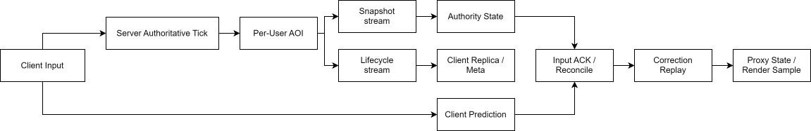
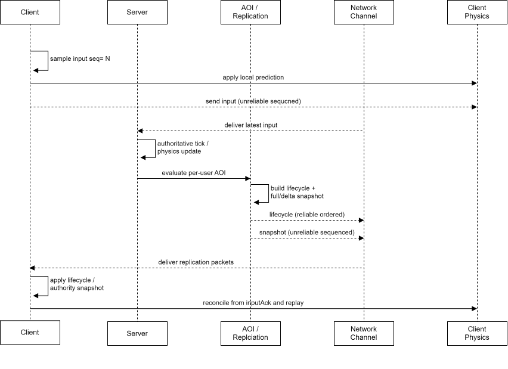
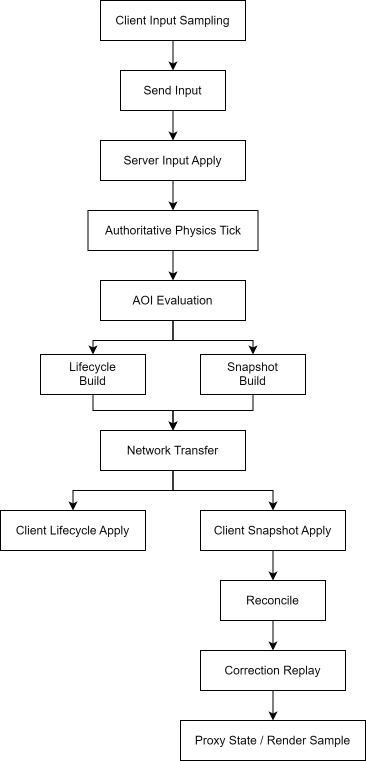
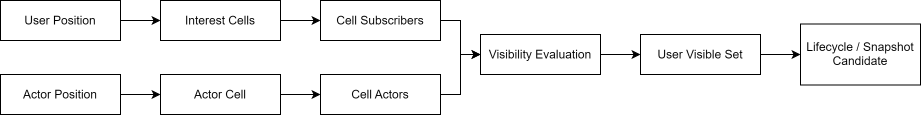
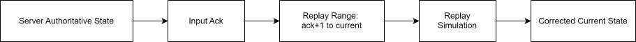
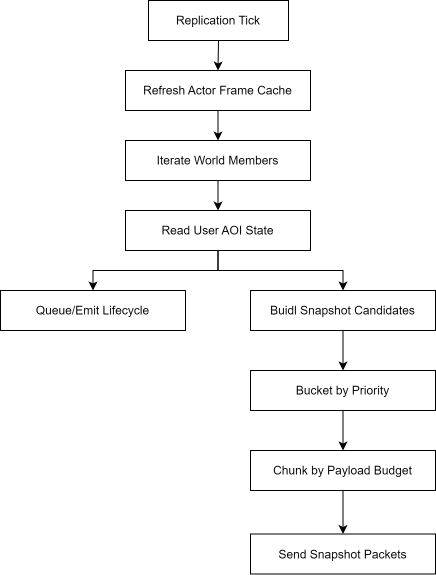
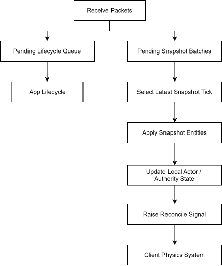
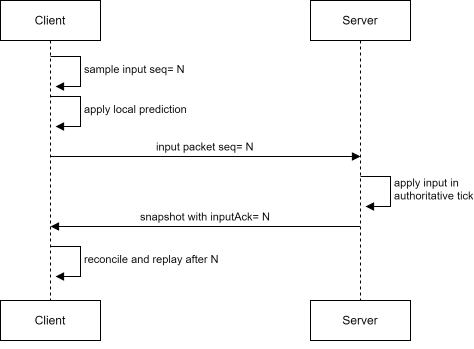
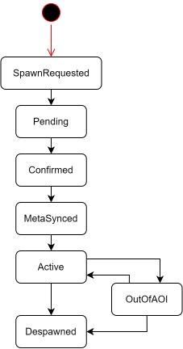

JamNet의 replication은 **서버 authoritative state를 사용자별 가시성, 네트워크 전송 정책, 클라이언트 prediction/replay와 연결해 재구성하는 동기화 파이프라인**입니다.

서버는 월드의 권위 상태를 만들고, 클라이언트는 그 상태를 그대로 덮어쓰는 대신 입력 이력과 replay를 통해 현재 표시 상태를 보정합니다. 핵심은 **서버가 옳다는 원칙을 유지하면서도, 클라이언트 입력 반응성을 잃지 않는 구조**를 만드는 것입니다.

---

## 1. 먼저 보는 전체 그림

Replication 전체 구조는 아래 흐름 하나로 볼 수 있습니다.

읽는 관점에서 중요한 점은 다음입니다.

- 서버는 authoritative tick을 기준으로 실제 월드 상태를 만듭니다.
- 서버는 모든 actor를 broadcast하지 않고, 사용자별 AOI를 기준으로 보낼 actor를 고릅니다.
- actor identity/meta는 lifecycle로 보내고, transform/state 갱신은 snapshot으로 보냅니다.
- snapshot은 full 또는 delta로 전송되며, delta는 사용자별 baseline을 기준으로 해석됩니다.
- 클라이언트 local actor는 즉시 prediction을 수행하고, 서버 snapshot의 input ack를 기준으로 reconcile/replay합니다.

즉 JamNet replication은 단순한 상태 복사가 아니라, **가시성, 전송 정책, baseline, prediction, replay가 연결된 상태 동기화 모델**입니다.

---

## 2. 대표 tick 흐름

아래는 클라이언트 입력 하나가 서버 권위 상태와 클라이언트 보정으로 이어지는 대표 흐름입니다.

이 흐름에서 lifecycle과 snapshot을 나누는 이유는 데이터의 의미가 다르기 때문입니다. actor 생성/삭제/meta는 반드시 의미와 순서가 보존되어야 하지만, transform snapshot은 오래된 값보다 최신 값이 중요합니다.

---

## 3. 설계 의도

JamNet은 다음 문제를 해결하기 위해 현재 replication 구조를 선택했습니다.

| 문제                                               | 설계 선택                             | 의도                                      |
| ------------------------------------------------ | --------------------------------- | --------------------------------------- |
| 서버 응답을 기다리면 입력 반응성이 낮아짐                          | client prediction + input history | 조작은 즉시 반응하게 하고 최종 판정은 서버가 하도록 분리        |
| 클라이언트 예측과 서버 상태는 어긋날 수 있음                        | input ack 기반 reconcile/replay     | 단순 위치 덮어쓰기보다 자연스럽게 현재 상태를 재구성           |
| 전체 월드를 broadcast하면 actor 수에 따라 bandwidth가 빠르게 증가 | 사용자별 AOI                          | 사용자에게 의미 있는 actor만 전송                   |
| actor 생성 정보와 위치 갱신은 신뢰성 요구가 다름                   | lifecycle/snapshot 분리             | lifecycle은 의미 보존, snapshot은 최신성 중심으로 전송 |
| delta snapshot은 기준 상태가 사용자마다 다름                  | per-user baseline                 | AOI 진입/이탈과 full/delta 전환을 안정적으로 처리      |
| replay를 모든 actor에 적용하면 CPU 비용이 커짐                | replay candidate/relevant 분리      | correction 품질과 비용 사이의 균형 유지             |

---

## 4. 설계 배경

실시간 멀티플레이에서 서버 권위 구조를 선택하면 클라이언트는 서버 상태를 따라야 합니다. 하지만 서버 응답을 기다린 뒤에만 움직이면 입력 반응성이 나빠집니다. 반대로 클라이언트가 마음대로 움직이고 서버는 나중에 맞추기만 하면 cheating, 충돌 불일치, 물리 drift 문제가 생깁니다.

JamNet은 이 문제를 다음 방향으로 해결합니다.

- 서버는 authoritative simulation을 수행한다.
- 클라이언트는 local input을 즉시 예측 적용한다.
- 서버 snapshot이 도착하면 authoritative state를 저장한다.
- local prediction과 서버 state가 어긋나면 input ack 이후 입력을 replay한다.
- remote actor는 authority/proxy state를 기준으로 부드럽게 표시 가능한 상태를 만든다.

이 구조의 목표는 "서버가 항상 옳다"와 "클라이언트 입력이 즉시 반응한다"를 동시에 만족시키는 것입니다.

---

## 5. 전체 흐름

Replication 전체 흐름은 다음처럼 볼 수 있습니다.

서버와 클라이언트의 역할은 대응됩니다.

| 서버                     | 클라이언트                     |
| ---------------------- | ------------------------- |
| authoritative state 생성 | authoritative state 수신/저장 |
| input ack 계산           | replay 기준 input ack 갱신    |
| AOI 계산                 | visible actor replica 유지  |
| lifecycle packet 생성    | actor 생성/삭제/meta 적용       |
| full/delta snapshot 생성 | baseline 기반 snapshot 복원   |
| snapshot chunk 전송      | 최신 tick 중심으로 snapshot 적용  |

이 흐름에서 lifecycle, snapshot, input은 같은 네트워크 stream으로 취급되지 않습니다. 각각 의미가 다르기 때문에 전송 channel도 다르게 선택합니다.

---

## 6. 핵심 설계 선택

### 6.1 사용자별 AOI

JamNet에서 AOI는 단순 bandwidth 최적화가 아니라 **grid 기반 Spatial Pub/Sub 시스템**입니다. Actor는 자신이 위치한 spatial cell에 publish되고, user는 자신의 관심 반경에 해당하는 cell들을 subscribe합니다. 서버는 이 publish/subscribe 관계를 이용해 사용자별 visible actor, newly entered actor, left actor를 갱신합니다.

기본 흐름은 다음과 같습니다.

구현은 user와 actor의 cell anchor를 따로 관리합니다. user가 cell 경계를 넘거나 hysteresis 기준을 넘으면 관심 cell subscription을 갱신하고, actor가 이동하면 publish cell membership을 갱신합니다. 변경된 cell 조합만 visibility evaluation 후보로 올리기 때문에 매 tick 모든 user와 모든 actor를 전수 비교하지 않습니다.

Visibility는 cell membership만으로 끝나지 않습니다. 설정에 따라 2D/3D AABB, circle/sphere 조건을 적용하고, 필요하면 LOS 검사 결과를 tick 단위 cache로 재사용합니다. 또한 static 또는 항상 보여야 하는 actor는 always visible set으로 다룹니다.

AOI가 영향을 주는 영역은 다음과 같습니다.

- 어떤 actor를 snapshot 후보에 넣을지
- 어떤 actor에 lifecycle create/meta/remove를 보낼지
- full snapshot이 필요한 actor인지
- 사용자별 baseline을 유지할지 제거할지
- 클라이언트 replay에서 주변 actor를 얼마나 고려할지

전체 월드 broadcast를 선택하면 구현은 단순하지만 actor 수가 늘어날수록 bandwidth가 빠르게 증가합니다. JamNet은 cell subscription, visible membership, entered/left event를 유지하는 비용을 감수하고, 실제로 해당 사용자에게 의미 있는 actor만 전송하는 방향을 선택했습니다.

### 6.2 사용자별 baseline

Delta snapshot은 기준 상태가 있어야 해석할 수 있습니다. JamNet은 baseline을 전역 하나로 두지 않고 사용자별로 관리합니다.

이유는 사용자마다 보이는 actor가 다르기 때문입니다. 어떤 사용자는 actor A를 계속 보고 있었고, 다른 사용자는 방금 AOI에 들어와 처음 봅니다. 전자는 delta를 받을 수 있지만 후자는 full state가 필요합니다.

사용자별 baseline의 trade-off는 명확합니다.

- 장점: AOI 진입/이탈과 delta 전송을 자연스럽게 연결할 수 있다.
- 비용: `사용자 x visible actor` 관계만큼 메모리와 상태 관리 비용이 증가한다.

JamNet은 MMO-like 환경에서 bandwidth를 줄이는 것이 중요하므로 이 비용을 감수합니다.

### 6.3 Lifecycle과 Snapshot 분리

Lifecycle은 actor가 존재하는지, 어떤 prefab인지, 누가 소유/조종하는지, 어떤 meta를 갖는지를 다룹니다. Snapshot은 위치, 회전, 속도 같은 지속 갱신 상태를 다룹니다.

두 데이터를 하나의 stream으로 묶으면 정책 충돌이 생깁니다.

- lifecycle은 손실되면 actor를 해석할 수 없으므로 reliable ordered가 필요하다.
- snapshot은 최신 상태가 중요하고 오래된 값은 버릴 수 있으므로 unreliable sequenced가 적합하다.

따라서 JamNet은 lifecycle과 snapshot을 별도 packet으로 나누고, 네트워크 channel도 다르게 선택합니다.

### 6.4 Prediction과 Replay

클라이언트는 입력을 보낼 때 서버 응답을 기다리지 않고 local physics에 먼저 적용합니다. 이 예측 상태는 빠른 반응성을 주지만, 서버 authoritative state와 차이가 날 수 있습니다.

단순 overwrite 방식은 구현은 쉽지만 순간 이동처럼 보일 수 있고, 충돌/상호작용이 있는 상황에서 부자연스럽습니다. JamNet은 서버가 인정한 input ack를 기준으로, 그 이후 입력을 다시 재생해 현재 상태를 재구성합니다.

Replay는 비용이 있으므로 모든 actor를 매번 되감지 않습니다. replay 후보와 실제 relevant actor를 구분하고, local actor 주변의 영향을 줄 수 있는 actor만 포함하도록 범위를 제한합니다.

---

## 7. Replication 규칙

JamNet의 replication은 다음 규칙으로 요약할 수 있습니다.

| 상황 | 처리 |
| --- | --- |
| 사용자가 월드에 들어옴 | 사용자 replication state 생성, lifecycle sync 예산 부여 |
| actor가 처음 AOI에 들어옴 | lifecycle create/meta + full snapshot |
| actor가 이미 known 상태 | delta snapshot 우선 |
| actor baseline epoch가 다름 | full snapshot 재전송 |
| actor가 AOI에서 나감 | removal lifecycle 또는 out-of-AOI 처리 |
| actor가 파괴됨 | 모든 known user에서 제거/lifecycle despawn |
| delta 생성 실패 | full snapshot fallback |
| 주기적 full 시점 | full snapshot으로 baseline 갱신 |
| lifecycle/meta 강제 동기화 | 일정 budget 동안 meta/full sync 유지 |

이 규칙의 목적은 클라이언트가 "이 snapshot이 어떤 actor에 대한 것인지", "delta를 어떤 baseline으로 해석해야 하는지", "이 actor가 local actor인지 remote actor인지"를 안정적으로 판단하게 만드는 것입니다.

---

## 8. 서버 측 흐름

서버는 tick마다 authoritative world 상태를 기준으로 사용자별 lifecycle과 snapshot을 만듭니다.

### 8.1 Actor frame cache

서버는 매 snapshot마다 actor의 replication 가능 여부, body type, active/static 여부, full epoch, 예상 full/delta 크기를 캐시합니다. 이 캐시는 매 사용자별 후보를 만들 때 반복 비용을 줄이고, dirty actor만 갱신하기 위한 기반이 됩니다.

### 8.2 사용자별 후보 선정

각 사용자에 대해 AOI visible actor 목록을 조회하고 snapshot 후보를 만듭니다. 여기서 AOI는 "거리 계산 함수"가 아니라, 앞 장에서 설명한 spatial subscription 결과입니다. user가 subscribe 중인 cell과 actor가 publish 중인 cell의 교집합에서 후보가 나오고, visibility test를 통과한 actor만 per-user visible set에 남습니다.

후보는 다음 기준으로 분류됩니다.

- 반드시 full을 보내야 하는 actor
- character처럼 우선순위가 높은 delta actor
- 일반 delta actor
- 낮은 우선순위 actor

Full이 필요한 대표 조건은 다음과 같습니다.

- 사용자가 해당 actor를 처음 본다.
- actor의 full epoch가 사용자 baseline과 다르다.
- AOI에 방금 들어왔다.
- force full budget이 남아 있다.
- 주기적 full sync 시점이다.

### 8.3 Lifecycle 생성

Lifecycle은 pending event로 쌓인 뒤 batch로 전송됩니다. create, meta, removal 같은 event는 snapshot과 분리되어 reliable ordered channel로 나갑니다.

Lifecycle이 먼저 안정적으로 도착해야 snapshot을 해석할 수 있습니다. 예를 들어 클라이언트가 아직 모르는 actor의 snapshot만 받으면 prefab, body type, ownership 정보를 알 수 없어 제대로 복원할 수 없습니다.

### 8.4 Full과 Delta

Full snapshot은 actor의 절대 상태를 담고, client baseline을 갱신합니다. Delta snapshot은 baseline 대비 차이만 담습니다.

Rigid body와 character는 서로 다른 압축 포맷을 사용합니다. Rigid는 position, rotation, velocity 중심이고, character는 position, yaw/pitch, vertical/horizontal speed, movement direction, state flags 등을 담습니다.

Delta pack이 실패할 수 있는 상황도 있습니다. 예를 들어 baseline 대비 위치 차이가 delta range를 넘으면 delta로 표현할 수 없습니다. 이 경우 full snapshot으로 fallback합니다.

### 8.5 전송 budget과 chunking

Snapshot은 MTU와 payload budget을 고려해 chunk로 나뉩니다. 한 packet에 너무 많은 actor를 넣으면 fragmentation 가능성이 커지고, snapshot 손실 시 피해 범위도 커집니다.

JamNet은 snapshot actor 후보를 우선순위 bucket으로 정렬하고, payload budget 안에서 여러 snapshot packet으로 나눕니다. Snapshot packet은 `UNRELIABLE_SEQUENCED`로 전송되므로, 늦게 도착한 오래된 snapshot은 클라이언트에서 버릴 수 있습니다.

---

## 9. 클라이언트 측 흐름

클라이언트는 lifecycle과 snapshot을 각각 queue에 넣고, tick에서 처리합니다.

### 9.1 Lifecycle 적용

Lifecycle packet은 actor 생성, 제거, meta 적용을 처리합니다. 새 actor가 들어오면 NetId를 기준으로 replica를 만들고, prefab/body type/meta를 적용합니다. 소유권과 조종권 정보가 들어오면 local actor 여부도 갱신합니다.

Local actor는 camera, input, prediction, reconcile의 기준이 됩니다. 따라서 local actor 판별은 단순 표시용 정보가 아니라 클라이언트 simulation의 기준입니다.

### 9.2 Snapshot batch 처리

Snapshot은 `UNRELIABLE_SEQUENCED` 전송이므로 누락될 수 있습니다. 클라이언트는 오래된 incomplete snapshot tick이 최신 tick을 막지 않도록, 최신 queued tick 중심으로 처리합니다. 더 오래된 tick은 버릴 수 있습니다.

Snapshot chunk는 같은 server tick 안에서 여러 packet으로 올 수 있습니다. 클라이언트는 받은 chunk를 batch로 모으고, 처리 가능한 최신 tick의 entity들을 적용합니다.

### 9.3 Replica 해석

Snapshot entity는 NetId를 기준으로 local entity에 대응됩니다. 이미 존재하는 replica면 기존 entity에 적용하고, 없으면 lifecycle로 만들어진 replica를 찾거나 생성 경로와 연결합니다.

중요한 점은 snapshot이 actor 생성의 모든 정보를 담지 않는다는 것입니다. Snapshot은 상태이고, actor identity/meta는 lifecycle이 담당합니다.

### 9.4 Authority state와 proxy state

클라이언트는 서버 snapshot에서 복원한 값을 authority state로 저장합니다. 이후 physics system은 authority state를 physics scene에 push하고, simulation 결과를 proxy state로 pull합니다.

상태는 역할별로 나뉩니다.

| 상태 | 의미 |
| --- | --- |
| Authority state | 서버 snapshot에서 복원한 기준 상태 |
| Proxy state | client physics/readback 결과로 표시 계층이 사용할 상태 |
| Live predicted state | local input을 즉시 반영한 현재 예측 상태 |
| Correction state | replay 이후 재구성된 local authoritative current |
| Replay history | 주변 actor를 replay 시점별로 복원하기 위한 이력 |

이 분리 덕분에 서버 상태 수신, 물리 시뮬레이션, 렌더링 샘플 생성, correction을 서로 다른 의미로 다룰 수 있습니다.

---

## 10. Input, Prediction, Reconcile

클라이언트 input은 매 tick sample되어 input history에 저장되고 서버로 전송됩니다.

Input packet은 `UNRELIABLE_SEQUENCED`로 전송됩니다. 오래된 입력이 늦게 도착하면 서버 simulation에 넣는 것이 오히려 해로울 수 있으므로 최신성을 우선합니다.

서버 snapshot에는 마지막으로 적용한 input sequence와 command epoch가 포함됩니다. 클라이언트는 이 값을 보고 어떤 input까지 서버가 인정했는지 판단합니다.

Reconcile 단계는 다음 순서로 동작합니다.

1. 서버 authority state와 local live predicted state의 오차를 계산한다.
2. 오차가 임계값 이하면 history만 정리하고 넘어간다.
3. 오차가 크면 authority state를 기준으로 rewind한다.
4. `inputAck + 1`부터 현재 input 직전까지 replay한다.
5. replay 결과를 correction state로 commit한다.

이 방식은 단순 순간이동 보정보다 비용이 크지만, 충돌과 상호작용이 있는 물리 기반 게임에서 더 일관된 결과를 만듭니다.

---

## 11. Replay 대상 선정

Correction replay에서 모든 actor를 매번 되감으면 비용이 커집니다. JamNet은 replay 후보와 실제 관련 actor를 분리합니다.

- `ReplayCandidate`: replay에 포함될 가능성이 있는 actor
- `ReplayRelevant`: 현재 local actor와 가까워 replay에 실제 포함할 actor
- `ReplayRetention`: enter/leave radius 사이에서 태그가 흔들리지 않도록 유지 시간 제공

Replay relevance는 local actor 주변 거리와 hysteresis를 기준으로 갱신됩니다. relevant actor는 replay 시점의 history를 찾아 replay scene에 push됩니다. history가 없으면 authority state를 fallback으로 사용합니다.

이 구조의 목적은 correction 품질과 CPU 비용 사이의 균형입니다.

---

## 12. Lifecycle 상태 흐름

Actor lifecycle은 단일 이벤트가 아니라 상태 흐름입니다.

이 흐름이 필요한 이유는 다음과 같습니다.

- 클라이언트 예측 spawn과 서버 확정 spawn을 연결해야 한다.
- actor prefab/body type/ownership/control meta가 snapshot보다 먼저 준비되어야 한다.
- 다른 actor를 target으로 참조하는 객체는 참조 대상이 준비된 뒤 활성화되어야 한다.
- AOI 이탈은 즉시 삭제가 아니라 hidden/out-of-AOI 상태로 다룰 수 있다.
- despawn은 physics actor 제거, replica 제거, render event 정리까지 포함한다.

Lifecycle을 reliable ordered로 보내는 이유는 이 상태 흐름의 순서가 의미를 가지기 때문입니다.

---

## 13. 네트워크 계층과의 연결

Replication 데이터는 네트워크 channel과 직접 연결됩니다.

| 데이터 | Channel | 이유 |
| --- | --- | --- |
| Input | `UNRELIABLE_SEQUENCED` | 오래된 입력 폐기 가능 |
| Snapshot | `UNRELIABLE_SEQUENCED` | 최신 snapshot이 이전 snapshot을 대체 |
| Lifecycle | `RELIABLE_ORDERED` | 생성/삭제/meta 순서 보존 |
| World assignment | `RELIABLE_ORDERED` | 월드 입장/이동 결과 보존 |

이 선택은 replication 안정성에 직접 영향을 줍니다. 예를 들어 lifecycle이 unreliable이면 snapshot이 도착해도 actor를 만들 수 없고, snapshot이 reliable ordered이면 오래된 상태 때문에 최신 상태 적용이 지연될 수 있습니다.

---

## 14. 압축과 Snapshot 포맷

JamNet은 full/delta snapshot을 압축된 bit representation으로 보냅니다. 목적은 bandwidth를 줄이되, 물리 상태 복원에 필요한 정밀도를 유지하는 것입니다.

대표적인 포맷은 다음과 같습니다.

| 대상 | Full 포맷 | Delta 포맷 | 주요 압축 방식 |
| --- | --- | --- | --- |
| Rigid body | 192bit | 128bit | world position quantization, quaternion 48bit, velocity magnitude/direction |
| Character | 160bit | 128bit | position 20bit per axis, yaw/pitch quantization, speed/moveDir/flags packing |

Full은 baseline을 새로 만드는 역할을 하고, delta는 baseline 대비 작은 변화만 보냅니다. 현재 codec은 월드 좌표를 고정 world bounds 안에서 UNorm quantization으로 압축하고, baseline 대비 위치 변화는 제한된 delta range 안에서 SNorm quantization으로 압축합니다. 예를 들어 world position은 축별 20bit를 사용하고, delta position은 축별 12bit로 표현합니다.

Rotation도 raw float를 그대로 보내지 않습니다. Rigid rotation은 quaternion에서 가장 큰 component를 생략하고 나머지 3개 component를 quantize하는 48bit 표현을 사용합니다. Character는 full에서는 yaw/pitch를 더 넓은 bit width로 보내고, delta에서는 baseline 대비 yaw/pitch 변화량을 더 작은 bit width로 보냅니다.

Character snapshot은 물리 위치만이 아니라 조작감에 필요한 상태도 함께 압축합니다. vertical velocity, horizontal speed, movement direction, state flags를 bit field로 packing해, 클라이언트가 authority state와 proxy state를 복원할 때 필요한 최소 정보를 유지합니다.

Delta pack이 실패하는 대표 상황은 baseline 대비 위치나 회전 변화가 delta 표현 범위를 벗어나는 경우입니다. 이때는 손상된 delta를 억지로 보내지 않고 full snapshot으로 fallback해 baseline을 다시 맞춥니다.

압축의 trade-off는 다음과 같습니다.

- bandwidth는 줄어든다.
- pack/unpack CPU 비용이 생긴다.
- world bounds와 quantization precision을 운영 환경에 맞게 정해야 한다.
- delta range를 너무 작게 잡으면 full fallback이 자주 발생한다.

---

## 15. 비용과 Trade-off

### 15.1 메모리 비용

사용자별 baseline, known actor set, pending lifecycle, replay history는 메모리를 사용합니다. 특히 baseline은 actor 수만이 아니라 사용자와 visible actor 관계 수에 비례합니다.

AOI가 넓거나 동시 접속자가 많으면 이 비용은 빠르게 증가합니다.

### 15.2 CPU 비용

서버는 AOI 계산, candidate bucket 정렬, full/delta pack, chunk build를 수행합니다. 클라이언트는 snapshot unpack, physics push/pull, replay simulation을 수행합니다.

Replay는 correction이 자주 발생하거나 replay 대상 actor가 많을수록 비용이 커집니다.

### 15.3 네트워크 비용

Full snapshot은 안정적이지만 큽니다. Delta snapshot은 작지만 baseline이 맞아야 합니다. AOI를 좁히면 평소 bandwidth는 줄지만 actor enter/leave가 잦아져 lifecycle과 full snapshot 비율이 늘 수 있습니다.

### 15.4 설계 복잡도

Lifecycle, snapshot, baseline, replay를 분리하면 시스템은 더 복잡해집니다. 대신 각 데이터의 의미와 실패 대응을 분리할 수 있어 운영상 더 예측 가능한 구조가 됩니다.

---

## 16. Failure Case

### 16.1 Snapshot loss

Snapshot은 손실될 수 있습니다. 일반적인 delta/snapshot 손실은 다음 snapshot으로 회복합니다. 다만 actor가 처음 보이는 시점의 full snapshot이 손실되면 baseline이 없으므로 다음 full 또는 force full 정책이 필요합니다.

### 17.2 Out-of-order snapshot

오래된 snapshot을 최신 상태 위에 적용하면 상태가 뒤로 돌아갑니다. 클라이언트는 최신 queued tick 중심으로 snapshot을 적용하고, 이미 적용한 tick보다 오래된 snapshot은 버립니다.

### 16.3 Lifecycle delay

Lifecycle이 snapshot보다 늦게 도착하면 snapshot을 해석할 actor meta가 없을 수 있습니다. 이를 줄이기 위해 lifecycle은 reliable ordered로 전송하고, 새 actor에는 full state budget을 부여합니다.

### 16.4 Delta baseline mismatch

클라이언트 baseline revision이 서버가 기대한 값과 다르면 delta를 정확히 복원할 수 없습니다. 이런 경우 full snapshot으로 fallback하거나 actor epoch를 갱신해야 합니다.

### 16.5 Delayed correction

서버 input ack가 늦게 오면 replay 범위가 길어집니다. JamNet은 `maxReplayInputs`로 한 번에 replay할 입력 수를 제한합니다. 범위를 초과하면 correction을 완전히 재구성하지 못할 수 있으므로, 표시 보정 정책과 함께 다뤄야 합니다.

### 16.6 Referenced actor not ready

Actor가 다른 actor를 target으로 참조할 수 있습니다. target actor가 아직 생성되지 않았다면 즉시 활성화하지 않고 deferred binding이나 pending 상태로 유지해야 합니다.

---

## 17. 개선 방향

### 17.1 Adaptive full snapshot

현재 full 전송은 주기, AOI enter, epoch mismatch, force budget에 의해 결정됩니다. 향후에는 손실률, delta 실패율, actor 이동량을 기반으로 full 전송 시점을 동적으로 조정할 수 있습니다.

### 17.2 Baseline memory 최적화

사용자별 baseline은 bandwidth를 줄이는 대신 메모리를 씁니다. actor state 압축, baseline 만료, AOI 이탈 후 보존 기간 조정으로 메모리 사용량을 줄일 수 있습니다.

### 17.3 Replay budget 관리

현재 replay는 입력 수와 relevant actor 범위로 비용을 제한합니다. 향후에는 한 frame당 replay CPU budget을 두고, local actor와 충돌 가능성이 높은 actor부터 우선순위를 줄 수 있습니다.

### 17.4 Lifecycle 복구 강화

Lifecycle 누락이나 지연이 감지되면 해당 actor를 full resync 대상으로 올리는 명확한 복구 경로가 필요합니다. Snapshot이 반복해서 오지만 actor meta가 없는 경우 자동 lifecycle 재요청 또는 force sync 정책을 둘 수 있습니다.

### 17.5 표현 계층 보정 정책

Replication은 authority/proxy/correction state를 제공합니다. 최종 화면 품질은 render interpolation, smoothing, correction delta 적용 방식에 따라 달라집니다. 이 부분은 별도 presentation policy로 분리해 조정하는 것이 좋습니다.

---

## 18. 요약

JamNet의 replication은 **사용자별 가시성과 입력 반응성을 기반으로 authoritative state를 재구성하는 동기화 파이프라인**입니다.

핵심은 다음과 같습니다.

- 서버는 AOI 기반으로 사용자별 visible actor만 전송한다.
- lifecycle과 snapshot을 분리해 서로 다른 reliability/ordering 정책을 적용한다.
- full snapshot은 baseline을 만들고, delta snapshot은 bandwidth를 줄인다.
- 클라이언트는 prediction으로 입력 반응성을 확보하고, input ack 기반 replay로 서버 상태와 reconcile한다.
- replay 대상과 budget을 제한해 correction 품질과 CPU 비용 사이의 균형을 맞춘다.

이 구조는 단순 상태 복사가 아니라, 서버 권위, 네트워크 손실, 물리 보정, 클라이언트 체감 품질을 함께 다루는 replication 모델입니다.
