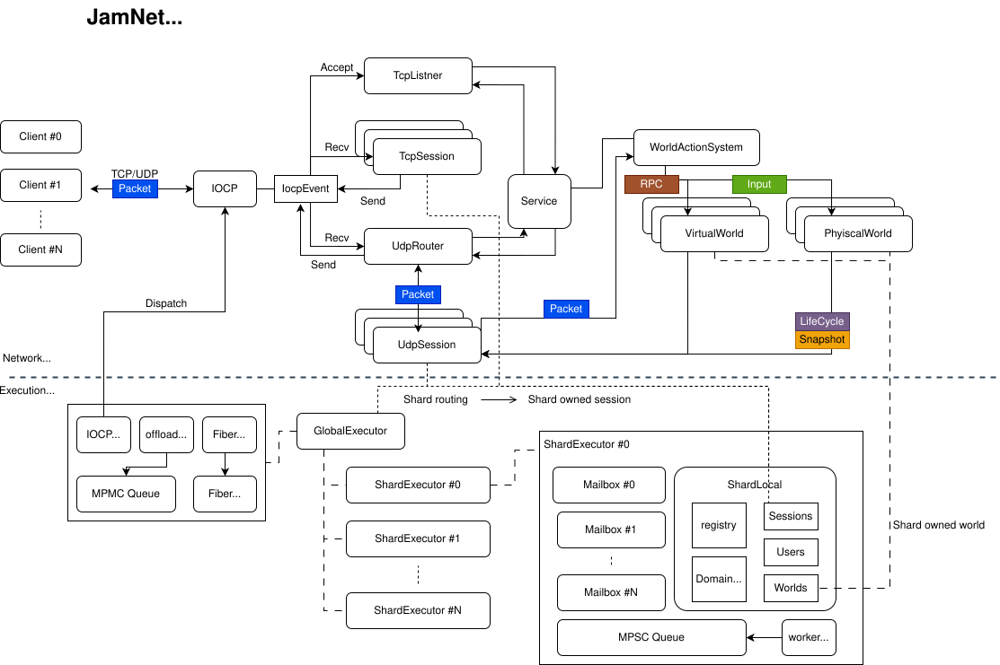
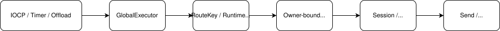
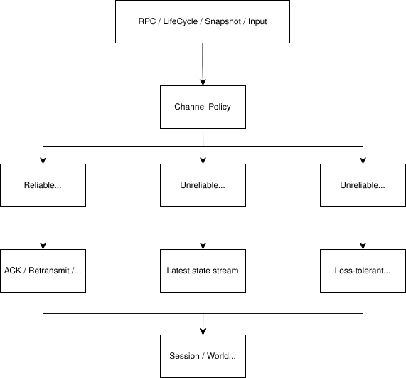
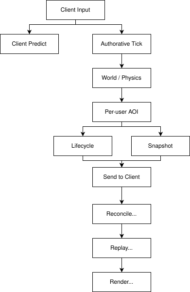

# JamNet

<a id="overview"></a>
## 1. 개요

JamNet은 C++ 기반의 **authoritative multiplayer server framework**입니다. IOCP 네트워크 처리, shard 기반 실행 모델, Reliable UDP transport, 서버 authoritative replication, prediction/replay 기반 client sync 를 하나의 런타임으로 연결하는 것을 목표로 한 개인 프로젝트입니다.

### **프로젝트 정보**

| 항목       | 내용                                                                          |
| -------- | --------------------------------------------------------------------------- |
| 프로젝트명    | JamNet                                                                      |
| 성격       | 개인 프로젝트로 정리한 실시간 멀티플레이 서버 런타임                                               |
| 목적       | Authoritative multiplayer server framework                                  |
| 언어 / 플랫폼 | C++20 / Windows x64                                                         |
| 주요 기술    | IOCP, TCP/UDP, Reliable UDP, Job/Fiber executor, ECS, FlatBuffers, PhysX 연동 |
| 개발 기간    | 2025.03 ~ (15개월 차, 지속 개발 및 구조 개선 진행 중)                                      |
| 관련 모듈    | `JamNet`, `JamPx`, `TestApp`                                                |

### **구현 주요 범위**

- Windows IOCP 기반 TCP/UDP 네트워크 처리
- Reliable UDP (`ACK/NACK`, retransmit, fragmentation, batching)
- Job/Fiber 기반 shard execution 및 owner mailbox
- Session/User/World 기반 서버 런타임 구조
- packet buffer 및 hot object 재사용 메모리 관리 구조
- PhysicalWorld/VirtualWorld 기반 world assignment pipeline
- AOI, lifecycle, full/delta snapshot replication
- prediction/reconcile/replay 기반 client correction pipeline
- ECS actor state 및 PhysX 연동 구조

### **현재 검증된 범위**

- 101개 UDP client session 기준 session/executor metric 관측  
- packet loss 및 retransmit backlog 없는 정상 상태 확인  
- wire RTT 와 runtime pipeline RTT 분리 측정  
- shard executor workload 및 queue 분산 관측  
- UDP datagram batching 및 goodput 관측  
- 단일 `ServerPhysicalWorld` 기준 shard workload 차이 확인
### **다음 마일스톤 (미검증 범위)**  
  
- multi-world 배치 환경에서의 실제 확장률 측정  
- executor p95/p99 queue wait 및 tail latency 분석  
- reliable UDP retransmit / fragmentation 안정성 검증  
- snapshot full/delta 비율 및 bandwidth 변화 분석  
- correction replay 비용 및 보정 품질 측정  
- world transfer rollback 및 failure handling 강화

### **구현/검증 상태 표**

| 항목                | 구현  | 기능 검증 | Stress 검증 |
| ----------------- | --- | ----- | --------- |
| IOCP TCP/UDP      | O   | O     | △         |
| RUDP retransmit   | O   | O     | △         |
| fragmentation     | O   | △     | X         |
| shard execution   | O   | O     | △         |
| mailbox routing   | O   | O     | △         |
| AOI replication   | O   | O     | X         |
| replay correction | O   | △     | X         |
| world transfer    | △   | X     | X         |
```
O : 구현 및 정상 동작 확인  
△ : 제한적 검증 또는 일부 구현  
X : 미구현 또는 미검증
```


### **관련 링크**

- GitHub: [akxotjr/Jam](https://github.com/akxotjr/Jam.git)
- 상세 문서:
  - [Execution Model](https://github.com/akxotjr/Jam/blob/master/docs/architecture/JamNet_ExecutionModel.md)
  - [Network Model](https://github.com/akxotjr/Jam/blob/master/docs/architecture/JamNet_NetworkModel.md)
  - [Replication](https://github.com/akxotjr/Jam/blob/master/docs/architecture/JamNet_Replication.md)
- Demo Video:  [Demo video](https://github.com/akxotjr/Jam/blob/master/docs/video/101-client_demo_video.mp4) 

<div style="page-break-before: always;"></div>

---

<a id="toc"></a>
## 2. 목차

- <a href="#overview">1. 개요</a>
- <a href="#toc">2. 목차</a>
- <a href="#terms">3. 용어 정리</a>
- <a href="#motivation">4. 왜 만들었는가</a>
- <a href="#design-decisions">5. 핵심 설계 결정</a>
- <a href="#design-goals">6. 핵심 설계 목표</a>
- <a href="#architecture">7. 시스템 아키텍처 개요</a>
- <a href="#troubleshooting">8. Troubleshooting 및 개선</a>
- <a href="#execution-model">9. 실행 모델</a>
- <a href="#network-model">10. 네트워크 모델</a>
- <a href="#memory-management">11. 메모리 관리</a>
- <a href="#state-sync">12. 서버-클라이언트 상태 동기화</a>
- <a href="#benchmark">13. 벤치마크 및 검증</a>
- <a href="#lessons">14. 배운점</a>
- <a href="#future-work">15. 향후 개선방향</a>


<div style="page-break-before: always;"></div>

---

<a id="terms"></a>
## 3. 용어 정리

| 용어                           | 의미                                                                                                                 |
| ---------------------------- | ------------------------------------------------------------------------------------------------------------------ |
| Authoritative server         | 최종 게임 상태를 클라이언트가 아니라 서버가 결정하는 구조입니다. 클라이언트 입력은 요청으로 처리되고, 서버 상태가 최종 기준이 됩니다.                                       |
| Shard                        | 상태 변경 작업을 나누어 실행하는 단위입니다. 같은 owner의 작업은 같은 shard에서 순서대로 처리됩니다.                                                     |
| Owner                        | 특정 상태를 책임지는 실행 주체입니다. session, user, world, actor 같은 mutable state는 owner를 기준으로 실행 위치가 정해집니다.                      |
| Mailbox                      | owner로 들어오는 job을 모아두는 큐입니다. 다른 스레드나 shard에서 직접 상태를 건드리지 않고 mailbox에 작업을 넣습니다.                                      |
| Job                          | executor에서 실행되는 작업 단위입니다. 네트워크 이벤트, world action, replication 처리 등이 job으로 전달됩니다.                                   |
| Fiber                        | OS thread를 block하지 않고 대기 상태를 표현하기 위한 경량 실행 단위입니다.                                                                  |
| AOI                          | Area of Interest의 약자입니다. 각 user에게 어떤 actor가 보이는지 결정하는 가시성 범위입니다.                                                   |
| Snapshot                     | 서버가 특정 tick에서 만든 actor 상태 묶음입니다. 클라이언트는 이 데이터를 기준으로 표시 상태를 보정합니다.                                                  |
| Delta snapshot               | 전체 상태가 아니라 이전 기준 상태와 달라진 부분만 보내는 snapshot입니다.                                                                      |
| Baseline                     | delta snapshot을 만들 때 기준이 되는 actor의 이전 full 상태입니다. J                                                                |
| Prediction                   | 클라이언트가 서버 응답을 기다리지 않고 입력 결과를 먼저 적용하는 방식입니다.                                                                        |
| Reconcile                    | 서버가 인정한 입력 지점에 맞춰 클라이언트 예측 상태를 다시 맞추는 과정입니다.                                                                       |
| Replay                       | reconcile 이후 아직 서버가 확정하지 않은 입력을 다시 재생해 현재 표시 상태를 복원하는 과정입니다.                                                       |
| WorldAction                  | 입장, 이동, 퇴장, 승격 같은 world membership 변경을 공통 절차로 처리하는 요청 모델입니다.                                                       |
| PhysicalWorld / VirtualWorld | 물리 시뮬레이션과 actor 상태를 실제로 갱신하는 world를 PhysicalWorld, 대기실이나 매칭처럼 논리적 membership 중심으로 동작하는 world를 VirtualWorld로 구분합니다. |

---

<a id="motivation"></a>
## 4. 왜 만들었는가

JamNet을 만든 이유는 게임 서버의 어려움이 소켓 API 사용법보다 **실시간 상태를 안전하고 예측 가능하게 유지하는 구조**에 있다고 생각했기 때문입니다.

처음에는 서버, graphics/editor 등 각 파트를 합쳐 하나의 엔진 형태로 발전시키는 구상을 했습니다. 당시 역할을 나누어 저는 네트워크 서버와 런타임 구조를 맡았고, 다른 팀원은 graphics/editor 쪽을 맡았습니다.

하지만 시간과 난이도 때문에 전체 엔진 통합까지는 진행하지 못했습니다. 이후 각자 맡았던 영역을 분리해 개인 프로젝트로 정리하고 발전시키는 방향으로 전환했습니다. 따라서 이 문서에서 다루는 JamNet은 초기 팀 구상 전체가 아니라, **제가 맡았던 서버 파트를 독립적으로 정리하고 추가 구현한 개인 프로젝트**입니다.

기성 엔진의 네트워크 기능을 사용하는 대신 직접 구현한 이유는, 성능 숫자만 보는 것이 아니라 다음 결정을 코드 레벨에서 통제하고 싶었기 때문입니다.

- 어디에서 순서를 보장하고, 어디에서 손실을 허용할 것인가
- 어떤 상태를 어떤 shard가 소유하고, 외부에서는 어떻게 접근하게 할 것인가
- 서버 authoritative 구조에서 클라이언트 입력 반응성과 상태 일관성을 어떻게 함께 만족시킬 것인가
- 월드, 세션, actor, replication이 서로 직접 얽히지 않게 어떤 경계를 둘 것인가

---

<a id="design-decisions"></a>
## 5. 핵심 설계 결정

이 프로젝트의 설계 결정은 대부분 "더 빠른 구조"보다 **문제가 생겼을 때 원인을 추적할 수 있는 구조**를 우선한 결과입니다.

| 설계 결정 | 버린 방향 | 선택한 이유 | 감수한 비용 |
| --- | --- | --- | --- |
| owner 기반 shard 직렬화 | 공유 객체마다 lock을 추가 | 상태 변경 순서를 lock 획득 순서가 아니라 실행 위치로 설명하기 위해 | shard hotspot과 cross-owner 지연 |
| channel별 전송 정책 | 모든 payload를 reliable ordered로 전송 | snapshot, input, lifecycle, RPC의 지연/순서/도달 요구가 다르기 때문에 | ACK/NACK, ordering, retransmit 구현 복잡도 |
| prediction + reconcile + replay | 서버 snapshot을 그대로 덮어쓰기 | 서버 권위를 유지하면서도 입력 반응성을 보존하기 위해 | input history와 replay 비용 |
| actor별 shared baseline + user별 known epoch | 월드 전체 broadcast 또는 사용자별 baseline 복제 | full/delta 기준 상태는 actor별로 재사용하되, 각 user가 알고 있는 full epoch는 다르기 때문에 | actor cache와 user별 known state를 함께 관리 |
| WorldAction 기반 월드 배정 | 컨텐츠별 입장/이동 코드 | 필드, 던전, 룸, 개인 공간을 같은 실패/rollback 모델로 다루기 위해 | 추상화 초기 설계 비용 |

즉 JamNet의 핵심 가치는 "이 기능을 구현했다"보다, **실시간 서버에서 서로 충돌하는 요구사항을 어떤 경계로 나누고 어떤 비용을 받아들였는지**에 있습니다.

---
<a id="design-goals"></a>
## 6. 핵심 설계 목표

JamNet의 설계 목표는 **MMORPG 서버에서 동시에 필요한 처리량, 응답성, 상태 일관성이 서로 충돌할 때 어느 쪽을 어떤 구조로 분리할지 결정하는 것**이었습니다.

| 실제 게임에서 생기는 문제 | 왜 어려운가 | 설계 방향 |
| --- | --- | --- |
| 필드 보스, 파티 전투, 드랍 처리처럼 여러 사용자가 같은 상태를 건드림 | lock만 늘리면 순서와 호출 경로 추적이 더 어려워짐 | owner shard에서 상태 변경 순서 고정 |
| 이동, 스킬 조준, 피격 반응은 지연이 길면 바로 체감됨 | 서버 권위만 강조하면 조작감이 나빠짐 | prediction은 허용하고 snapshot으로 보정 |
| 위치 snapshot과 actor 생성/삭제는 전송 요구가 다름 | 한 전송 정책에 묶으면 지연 또는 의미 손실이 발생 | channel별 reliability/order 분리 |
| 필드, 던전, 룸, 개인 공간의 입장/이동 흐름이 반복됨 | 컨텐츠별 코드가 늘면 실패/rollback 처리가 중복됨 | WorldAction으로 배정/이동 모델 공통화 |
핵심은 서버를 단순히 빠르게 만드는 것이 아니라, **문제가 생겼을 때 어떤 경계에서 잘못됐는지 추적 가능한 구조**를 만드는 것입니다. 그래서 JamNet은 모든 경로를 하나로 단순화하지 않았습니다. 상태 변경, 전송 정책, 월드 배정, 클라이언트 보정을 각각 분리했고, 그 사이를 명시적인 경계로 연결했습니다.

세부 구현은 실행 모델, 네트워크 모델, replication 문서에서 각각 분리해 설명합니다.
<div style="page-break-before: always;"></div>

---
<a id="architecture"></a>
## 7. 시스템 아키텍처 개요




JamNet은 네트워크 전송 계층, 실행 모델, 월드 런타임, 물리/ECS 상태, replication, 클라이언트 보정 흐름을 하나의 서버 런타임 안에서 연결합니다.

이 구조에서 핵심 경계는 세 가지입니다.

- **Transport와 Runtime 분리**: 네트워크 완료 이벤트가 곧바로 게임 상태를 바꾸지 않고, 실행 모델을 거쳐 owner shard로 전달됩니다.
- **Execution과 State Ownership 연결**: session, world, actor 상태는 owner 단위로 shard에 귀속되어 순서가 보장됩니다.
- **Replication과 Client Sync 연결**: 서버 snapshot은 클라이언트에서 그대로 덮어쓰이지 않고, prediction/reconcile/replay를 통해 현재 표시 상태로 재구성됩니다.

JamNet은 `JamBase`, `JamPx`와 함께 동작합니다.
- `JamBase`: 공통 타입, assert, logger, hash, tagged key 등 기반 유틸리티
- `JamPx`: PhysX 기반 물리 actor, character, rigid body, prefab/level loading
- `JamNet`: 네트워크 런타임, executor, session, world, replication
- `TestApp`: 테스트 서버/클라이언트와 샘플 컨텐츠
<div style="page-break-before: always;"></div>

---
<a id="troubleshooting"></a>
## 8. Troubleshooting 및 개선

이 장은 설계 선택 자체보다, 실제 구현과 부하 테스트 과정에서 발생한 문제를 어떻게 추적하고 수정했는지에 초점을 둡니다.

### 8.1 Mailbox ready notification race로 shard job이 실행되지 않던 문제

- **상황**
  - 100개 이상의 UDP client를 동시에 접속시키는 테스트에서 일부 `UdpSession`의 send 경로가 멈췄습니다.
  - `UdpSession::Send` 내부에서 `SessionSystem`과 OS send 호출로 이어지는 작업을 shard job으로 `Post`했고, `Post` 자체는 성공했지만 이후 job이 실행되지 않았습니다.
  - 적은 수의 client에서는 거의 보이지 않았고, burst 상황에서만 재현되었습니다.

- **핵심 원인**
  - 처음 의심한 원인은 shard local queue의 priority starvation이었습니다.
  - call stack을 따라 로그와 중단점으로 확인한 결과, control priority job이 계속 들어오는 동안 background job이 영구적으로 밀릴 수 있는 경로를 발견했습니다.
  - 이 문제를 먼저 수정했지만 동일 증상이 남아 있었고, 실제 원인은 `Mailbox` ready notification의 lost wake-up 가능성이었습니다.
  - consumer가 mailbox를 처리 중인 순간 producer가 새 job을 넣으면, queue에는 job이 남아 있지만 shard ready queue에 mailbox가 다시 들어가지 않는 상태가 가능했습니다.

- **수정 방향**
  - `ShardExecutor`의 local queue 선택 정책에 control job 연속 처리 제한을 추가해 priority starvation 가능성을 줄였습니다.
  - `Mailbox`에는 repost 요청 상태를 추가했습니다.
  - `Post`, `PostBulk`, `OnJobExecuted`, `ProcessMailbox` 경로에서 processing 중 추가 job이 들어오거나 ready enqueue가 실패하면 repost를 요청하고, mailbox 소비가 끝난 뒤 남은 job 또는 repost 요청을 확인해 다시 ready queue에 넣도록 바꿨습니다.

- **결과 및 배운점**
  - enqueue 성공 여부만으로는 job 실행을 보장할 수 없다는 점을 확인했습니다.
  - MPSC queue 자체보다 **queue와 scheduler 사이의 ready 상태 전이**가 더 위험한 지점이었습니다.
  - ready notification은 중복 알림을 줄이는 것뿐 아니라 lost wake-up이 없는지도 함께 검증해야 했습니다.

### 8.2 InvokeOnShard 기반 fiber wait가 burst 상황에서 재개되지 않던 문제

- **상황**
  - `std::future` 기반 wait를 줄이기 위해 `InvokeOnShard()`를 도입했습니다.
  - 의도는 다른 shard에서 실행되어야 하는 함수를 fiber 기반 await로 감싸, OS thread를 block하지 않고 결과를 기다리는 것이었습니다.
  - 초기 `WorldActionSystem`에서는 user shard, world shard, directory 갱신 사이의 전환을 편하게 표현하기 위해 이 방식을 여러 지점에서 사용했습니다.
  - 다수 client가 동시에 world assignment와 actor spawn 흐름에 들어오는 burst 상황에서 일부 action이 이후 단계로 진행되지 않았습니다.

- **핵심 원인**
  - 처음에는 특정 world action 단계의 누락이나 callback 호출 실패를 의심했습니다.
  - 실제로는 shard 간 호출과 fiber resume 조건이 맞물리면서 기대한 시점에 다시 스위칭되지 않는 경로가 있었습니다.
  - `InvokeOnShard()`를 동기식 함수 호출처럼 넓게 사용하면서, 어느 shard가 어떤 상태를 소유하고 어떤 continuation이 어느 queue에서 재개되어야 하는지 추적하기 어려워졌습니다.

- **수정 방향**
  - `InvokeOnShard()` 사용을 최소화했습니다.
  - world action 흐름을 단방향 job chain에 가깝게 다시 정리했습니다.
  - user shard에서 요청 상태를 기록하고, target world shard에는 필요한 작업만 `Submit`합니다.
  - 완료 또는 실패 결과는 다시 user shard로 post해서 membership, rollback, response 처리를 진행하도록 바꿨습니다.

- **결과 및 배운점**
  - 코드가 일부 길어지는 대신 shard 간 제어 흐름이 명시적인 message passing 형태로 남았습니다.
  - burst 상황에서 fiber resume에 의존하는 범위를 줄였습니다.
  - in-flight action과 rollback 지점을 user context 중심으로 추적할 수 있게 됐습니다.

### 8.3 AOI 갱신 비용이 user 수 x actor 수로 증가하던 문제

- **상황**
  - 초기 AOI 계산은 user character 기준으로 actor 가시성을 검사하는 단순한 방식이었습니다.
  - 같은 `PhysicalWorld`에 접속한 user와 actor 수가 늘어날수록 매 tick 비용이 `user 수 x actor 수`에 가까워졌습니다.
  - 적은 인원에서는 문제가 드러나지 않지만, 동접 수가 늘어나면 AOI 계산이 replication 이전 단계의 병목이 될 수 있었습니다.

- **핵심 원인**
  - 모든 user가 모든 actor를 검사하는 구조가 문제였습니다.
  - 실제로 매 tick마다 전체 조합을 볼 필요는 없고, 위치가 바뀐 user/actor와 그 주변 cell만 다시 평가하면 되는 상황이 많았습니다.

- **수정 방향**
  - AOI를 Spatial Pub/Sub 방식으로 바꿨습니다.
  - actor는 위치에 따라 spatial cell에 publish되고, user는 자신의 관심 범위에 해당하는 cell을 subscribe합니다.
  - user 또는 actor가 cell 경계를 넘거나 physics active list에 포함된 경우에만 dirty 대상으로 모읍니다.
  - `ServerAoiSystem`은 `m_cellActors`, `m_cellSubscribers`, `m_pendingVisibility`, `m_visibleMembership`을 통해 cell 기반 후보 집합과 사용자별 visible actor 관계를 관리합니다.

- **결과 및 배운점**
  - AOI 계산은 전체 user와 전체 actor를 매번 곱하는 방식에서, **위치 변화가 발생한 user/actor와 관련 cell의 관계만 갱신하는 방식**으로 바뀌었습니다.
  - actor 이동 시에는 old/new cell의 subscriber만 영향을 받고, user 이동 시에는 관심 cell 변화분에 포함된 actor만 다시 평가합니다.
  - CPU 비용을 줄이는 대신 cell membership, dead slot compact, pending visibility dedup 같은 부가 상태를 유지해야 합니다.
<div style="page-break-before: always;"></div>

---
<a id="execution-model"></a>
## 9. 실행 모델

실행 모델에서 가장 먼저 부딪힌 문제는 "멀티스레드로 만들면 빨라진다"가 항상 맞지 않는다는 점이었습니다. 게임 서버에서는 빠른 실행보다 **같은 owner의 상태가 어떤 순서로 바뀌었는지 설명 가능해야 하는 경우**가 많습니다.




공유 상태마다 lock을 붙이면 작은 예제는 단순하지만, 네트워크 수신, 세션 처리, 월드 tick, replication이 얽힐수록 호출 경로와 상태 변경 순서가 흐려집니다. hot path에서는 lock 경합도 생깁니다.

JamNet은 lock 대신 ownership execution boundary를 선택했습니다.

- owner가 없는 외부 이벤트는 전역 계층에서 흡수합니다.
- session/world/actor처럼 mutable state가 있는 작업은 route key로 owner shard에 보냅니다.
- cross-owner 접근은 직접 호출하지 않고 mailbox job으로 끊습니다.
- timeout, 예약 작업, RPC wait는 fiber로 분리해 worker를 block하지 않습니다.

같은 owner의 상태 변경 순서는 실행 위치로 설명됩니다. 대가는 shard hotspot과 cross-owner 지연입니다.

이를 완화하기 위해 route domain, affinity hint, load-aware placement로 session은 분산하고, world/actor는 필요한 경우 같은 실행 경계에 가깝게 배치합니다.

Shard 내부 queue, mailbox wake-up, fiber scheduling의 세부 구조는 [Execution Model](https://github.com/akxotjr/Jam/blob/master/docs/architecture/JamNet_ExecutionModel.md)에서 별도로 다룹니다.

<div style="page-break-before: always;"></div>

---

<a id="network-model"></a>
## 10. 네트워크 모델

네트워크 모델의 핵심 문제는 TCP/UDP 선택이 아니라, **게임 데이터마다 실패 방식이 다르다**는 점이었습니다.



예를 들어 이동 snapshot은 늦게 도착한 과거 값보다 다음 최신 값이 낫습니다. 반면 actor 생성/삭제, 던전 입장 결과, ownership 변경은 손실되면 클라이언트의 월드 해석이 깨집니다.

모든 데이터를 reliable ordered로 보내면 구현은 단순하지만, 오래된 snapshot 하나가 최신 snapshot까지 막는 head-of-line blocking이 생깁니다. 모두 unreliable로 보내면 lifecycle이나 RPC처럼 의미 보존이 필요한 데이터가 깨집니다.

| 데이터 | 필요한 성질 | 사용 방향 |
| --- | --- | --- |
| transform snapshot | 최신성, 낮은 지연 | sequenced/unreliable 계열 |
| input stream | 낮은 지연, 짧은 순서 의미 | UDP channel 정책 |
| actor lifecycle | 도달 보장, 순서 보장 | reliable ordered |
| 독립 RPC/event | 도달 보장, 전체 순서 대기 최소화 | reliable unordered |
| 연결/제어 흐름 | 안정적인 제어 | TCP 또는 system packet |

JamNet은 이 trade-off를 channel 정책으로 분리했습니다. latency-sensitive path는 오래된 데이터를 버리고, 의미 보존이 필요한 path는 ACK/NACK, retransmit, ordering, fragmentation을 사용합니다.

그 대가로 네트워크 계층은 단순 byte pipe가 아니게 됐습니다. session component가 pending reliable, ACK window, retransmit, ordered buffer, fragmentation, piggyback ACK 상태를 관리합니다.

ACK/NACK, retransmit, fragmentation, receive ordering처럼 channel 내부 구현은 [Network Model](https://github.com/akxotjr/Jam/blob/master/docs/architecture/JamNet_NetworkModel.md)에서 별도로 다룹니다.

<div style="page-break-before: always;"></div>

---

<a id="memory-management"></a>
## 11. 메모리 관리

메모리 관리에서의 문제는 단순히 allocation 횟수를 줄이는 것이 아니라, **packet data가 언제까지 살아 있어야 하는지 명확히 하는 것**이었습니다.

특히 reliable UDP에서는 원본 packet이 retransmit queue에 남아 있어야 합니다. 그런데 piggyback ACK처럼 송신 직전에 wire 형태를 바꾸는 처리가 원본 buffer를 직접 수정하면, 재전송 기준 데이터가 오염될 수 있습니다.

JamNet은 범용 allocator를 모두 대체하려 하지 않고, hot path와 lifetime이 까다로운 영역만 분리했습니다.

- `ObjectPool<T>`: IOCP event, fiber object처럼 타입이 고정되고 반복 생성/반납되는 hot object 재사용
- `BufferPool`: packet payload, TCP/UDP I/O buffer, piggyback ACK, clone buffer 등 네트워크 buffer 전용 pool
- `BufferSlice`: 하나의 block 안에서 header, payload, tailroom을 명시적으로 나누는 view
- `OwnedBufferSlice` / `OwnedBufferChain`: packet lifetime과 scatter-gather send를 표현하는 owned wrapper

핵심 결정은 `Packet`과 `PacketView`의 역할을 분리한 것입니다. 생명 보장이 필요한 경우에는 owned slice를 사용하고, 단순 해석이나 임시 접근에는 view를 사용합니다. 또한 UDP piggyback ACK처럼 송신 직전에 wire 형태가 바뀌는 경우 원본 retransmit packet을 직접 수정하지 않고, header slice, original payload slice, ack slice를 chain으로 묶어 전송합니다.

이 방식은 구조가 조금 복잡해지지만, packet copy와 control block atomic 비용을 줄이면서 buffer lifetime을 코드 구조상 더 명확하게 만듭니다.

---

<a id="state-sync"></a>
## 12. 서버-클라이언트 상태 동기화

상태 동기화의 핵심 trade-off는 **서버 권위와 클라이언트 조작감이 서로 반대 방향을 요구한다**는 점입니다.



전투 판정, 위치 검증, 아이템 획득, 몬스터 AI 결과를 클라이언트가 최종 결정하면 치트와 불일치를 막기 어렵습니다. 반대로 모든 입력을 서버 응답 후에만 반영하면 조작감이 나빠집니다.

서버 snapshot을 현재 위치에 그대로 덮어쓰는 방식도 피했습니다. 구현은 쉽지만, 충돌이나 주변 actor 영향이 있는 상황에서 순간 이동처럼 보이거나 물리 상태가 튀기 쉽습니다.

JamNet은 동기화 흐름을 다음 단계로 나눴습니다.

| 단계 | 역할 |
| --- | --- |
| Server authoritative tick | 월드의 최종 상태를 서버에서 갱신 |
| AOI / known actor 관리 | 사용자별로 보이는 actor와 이미 알고 있는 actor 구분 |
| lifecycle + snapshot 전송 | 생성/삭제와 transform 상태를 다른 정책으로 전달 |
| input ack reconcile | 서버가 인정한 입력 지점까지 클라이언트 예측 상태를 맞춤 |
| correction replay | 보정 이후의 local input을 다시 재생해 현재 표시 상태 재구성 |

모든 actor를 모든 사용자에게 보낼 수 없기 때문에 AOI는 사용자별 spatial pub/sub로 다룹니다. delta 가능 여부는 actor별 shared baseline과 user별 known epoch를 함께 보고 판단합니다.

대가는 메모리와 CPU 비용입니다. 사용자별 visible actor, known actor, known full epoch, replay history와 actor별 baseline cache를 함께 관리해야 합니다. 대신 클라이언트는 즉시 움직이고, 최종 판정은 서버 snapshot에 수렴하며, 이미 알고 있는 actor에는 delta snapshot을 보내 bandwidth를 줄입니다.

AOI state, actor별 baseline cache, user별 known epoch, lifecycle/snapshot 적용 순서, replay candidate의 세부 구조는 [Replication](https://github.com/akxotjr/Jam/blob/master/docs/architecture/JamNet_Replication.md)에서 별도로 다룹니다.

---
<a id="benchmark"></a>
## 13. 벤치마크 및 검증  
  
현재 benchmark는 production scale 성능 측정보다는,  
JamNet runtime의 workload 분포와 지연 경로를 관찰하는 데 목적이 있습니다.  
  
### 테스트 환경  
- CPU: AMD Ryzen 7 8845HS (8c 16t)
- RAM: 32GB
- 101 UDP client session  
- 단일 ServerPhysicalWorld  
- 약 30pps cadence  
- loopback 환경  
- shard executor 4개  
  
### 주요 결과  
  
| 항목                 | 결과      |
| ------------------ | ------- |
| packet loss        | 0       |
| retransmit backlog | 0       |
| 평균 goodput         | 99.411% |
| 평균 wire RTT        | 0.094ms |
| 평균 pipeline RTT    | 3.923ms |

### 관찰 요약  
  
- packet loss 및 retransmit backlog 없이 정상 상태 유지  
- wire RTT보다 runtime pipeline RTT 비중이 더 크게 관측됨  
- owner-bound workload가 shard executor 기준으로 분리 처리됨  
- 단일 world 조건에서 특정 shard workload 집중 경향 확인  
  
### 현재 검증 범위  
  
현재 benchmark는 다음 범위까지만 검증된 결과로 사용합니다.  
  
- runtime pipeline RTT 관찰  
- shard workload 분포 관찰  
- retransmit backlog 없는 정상 상태 확인  
  
multi-world scaling, fragmentation stress, replication bandwidth 한계 등은 아직 추가 검증이 필요한 상태입니다.

---
<a id="lessons"></a>
## 14. 배운점

- **경계 설정이 개별 기술보다 중요함**
  - IOCP, UDP, fiber, ECS는 각각 도구일 뿐이고, 실제 난이도는 이 도구들이 만나는 경계에서 발생했습니다.
  - 네트워크 I/O, 실행 모델, world state, replication을 어디서 분리하고 연결할지가 서버 구조의 핵심이었습니다.

- **멀티스레드 구조는 상태 소유권부터 정해야 함**
  - 어떤 객체가 어느 shard에 속하는지 먼저 정하지 않으면 병렬 처리는 오히려 복잡도를 키웠습니다.
  - cross-owner 호출, tick, event job의 순서를 실행 위치로 설명할 수 있어야 했습니다.

- **신뢰성은 yes/no 문제가 아님**
  - 어떤 데이터는 반드시 도착해야 하고, 어떤 데이터는 늦게 도착하면 버리는 편이 낫습니다.
  - 이 차이를 channel과 replication 정책으로 나누는 것이 latency와 consistency를 함께 다루는 기준이 됐습니다.

- **서버 권위와 클라이언트 반응성은 함께 설계해야 함**
  - prediction을 허용하면 reconcile과 replay가 필요합니다.
  - 자연스러운 보정을 위해 input history, baseline, replay, AOI가 함께 설계되어야 했습니다.

- **성능 최적화는 lifetime과 ownership 정리에서 시작됨**
  - packet buffer, retransmit queue, wire patching, owned/view 구분은 모두 데이터가 언제까지 살아 있어야 하는지 명확히 하기 위한 설계였습니다.
  - 복사를 줄이기 전에 ownership과 lifetime이 먼저 정리되어야 했습니다.

---
<a id="future-work"></a>
## 15. 향후 개선방향

- **Benchmark 재측정과 운영 지표 정리**
  - executor, network, replication을 분리해서 측정할 계획입니다.
  - burst recovery, tail latency, retransmit rate, snapshot bandwidth, replay cost를 같은 기준으로 볼 수 있게 정리해야 합니다.

- **Routing policy 고도화**
  - 현재는 stable route, placement, affinity hint를 제공합니다.
  - 실제 부하 분포에 따라 session, world, actor domain별로 다른 배치 정책이 필요할 수 있습니다.
  - world 단위 co-location과 hot shard 완화를 함께 고려해야 합니다.

- **Replication budget 관리**
  - 사용자별 AOI/known state와 actor별 baseline cache는 bandwidth를 줄이는 대신 메모리 비용을 만듭니다.
  - full snapshot 강제 시점, delta 실패 복구, lifecycle 재동기화, replay 대상 범위를 더 adaptive하게 조정할 필요가 있습니다.

- **Failure handling 강화**
  - shard는 상태 소유권의 단위이지만 아직 완전한 fault boundary는 아닙니다.
  - job 실패, mailbox close, world transfer rollback, session disconnect 같은 실패 흐름을 일관된 운영 정책으로 묶는 것이 다음 단계입니다.
